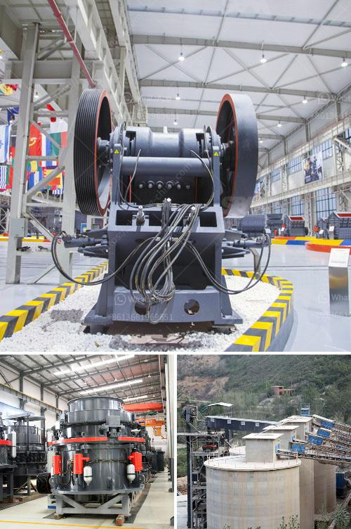

<h3>rock quarry crusher equipment</h3>
Rock quarry crusher equipment is widely used in mining, metallurgy, building materials, highway, railway, water conservancy and chemical industries. Its operation is simple, high efficiency and energy saving, with large crushing ratio, uniform product size, and suitable for crushing hard ore or rock. Therefore, the choice of rock quarry crusher equipment determines the quality and characteristics of the final product, and also affects the economic benefits of users.

The rock quarry crusher equipment mainly includes jaw crusher, cone crusher, impact crusher, hammer crusher, roller crusher, gyratory crusher, etc. It is widely used in metallurgy, building materials, chemical industry, mining and other fields. Crushing all kinds of minerals and rocks with compressive strength less than 320 MPa, such as iron ore, copper ore, gold ore, manganese ore, river pebble, dolomite, limestone, granite, basalt, etc.

Jaw crusher is the preferred equipment for coarse crushing and the first choice for primary crushing. It features high crushing ratio, uniform product size, simple structure, reliable performance, easy maintenance, and low operation cost. It is widely used in mining, metallurgy, building materials, highway, railway, water conservancy, and chemical industries.

Cone crusher is commonly used for secondary crushing, which has the characteristics of high production capacity, large crushing ratio, stable performance, and easy maintenance. It can be used for medium and fine crushing of various hardness stones.

Impact crusher is suitable for crushing medium-hard materials, such as limestone, concrete, etc. It has the advantages of large crushing ratio, high production efficiency, low energy consumption, and uniform particle size. Its finished product is cubic, with good grain shape, no tensile and crumb, and the finished product can be adjusted.

Hammer crusher is mainly composed of the rotor, hammer, counterattack lining board, screen plate, etc. It is widely used in mining, metallurgy, building materials, highway, railway, water conservancy, and chemical industries. It can crush materials with medium or lower hardness into medium and fine crushing, such as limestone, dolomite, shale, sandstone, coal, asbestos, graphite, salt, chalk, gypsum, etc.

Roller crusher has the advantages of simple structure, reliable performance, low cost, and convenient maintenance. It is mainly used for secondary and fine crushing of various medium hardness ores and rocks in metallurgy, chemical industry, building materials, etc. The crushed material has uniform particle size, low over crushing rate, convenient maintenance, overload protection, etc.

Gyratory crusher is a large-scale crushing machine, which uses a gyratory movement of the crushing cone in the crushing cavity to extrude, squeeze and bend the materials. It is suitable for medium and fine crushing of hardness materials, such as limestone, dolomite, gypsum, and so on.

In conclusion, the selection and configuration of rock quarry crusher equipment are important factors to ensure the quality and characteristics of the final product. Various types of crusher equipment have their own advantages, and users should choose the appropriate equipment according to their actual needs and production requirements, so as to achieve efficient operation and obtain good economic benefits.
<h3>Contact us</h3><ul><li><strong>Whatsapp:&nbsp;<a href="https://wa.me/8613661969651">+8613661969651</a></strong></li><li><a href="https://swt.shibang-china.com/?git&amp;zhl&amp;rock quarry crusher equipment"><strong>Online Service(chat now)</strong></a></li></ul><h3>Related</h3><ul><li><a href='ton crushing machine.md'>ton crushing machine</a></li><li><a href='open cast coal mining machinery process.md'>open cast coal mining machinery process</a></li><li><a href='sand making machine manufacturers.md'>sand making machine manufacturers</a></li><li><a href='specification of a ball mill.md'>specification of a ball mill</a></li><li><a href='ball mills in monterrey.md'>ball mills in monterrey</a></li></ul>