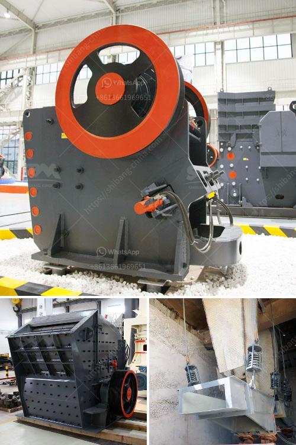

<h3>rock stone crusher</h3>
Rock stone crusher is a very useful equipment in many industries, such as mining, metallurgy, construction, highway, railway, water conservancy, and chemical industries. It can process a variety of materials, including rocks, ores, and stones. It is widely used in construction, building materials, metallurgy, mining, electricity, petroleum, coal, transportation, fertilizer, gas, and other industries.

The rock stone crusher machine is designed with the technology that absorbs the advanced technology from Germany and combines this with our own production experience. This crusher equipment is actually required in many industries for its unique properties and features.

The rock stone crusher machine stands out in the market with its excellent performance, high quality, and optimum efficiency. The crushing process of rock stone crusher is realized by its excellent design, which is based on the principle of inter-particle crushing, where individual particles are subject to a higher degree of compression and shear resulting in an efficient and high-quality crushing process.

The rock stone crusher machine mainly includes a jaw crusher, cone crusher, impact crusher, hammer crusher, and mobile crusher. The rock stone crusher plant is mainly used for metallurgy, chemical industry, building materials, hydropower and other materials that often need to be moved.

The rock stone crusher plant has high automation degree, low operating costs, high crushing ratio, large production capacity, and simple maintenance. It can be divided into fixed and mobile crushing plants. According to different production needs, it can be equipped with cone crusher, jaw crusher, impact crusher, etc. and also have a three-level screening system, which can meet different size requirements of customers.

The rock stone crusher machine is equipped with a variety of crushing modes, which can be adjusted according to the actual needs of users. Different crushing modes have different crushing capacity, which can meet the diverse needs of customers.

When crushing hard rock materials, the rock stone crusher machine works with high efficiency and low noise. The movable jaw assembly is made of high-quality cast steel and is driven by two large-sized cast steel flywheels. The heavy-duty eccentric shaft is processed by forging blanks, making the rock stone crusher have extraordinary reliability and durability. The bearing is mounted horizontally, making the crushing system more stable and balanced.

Overall, the rock stone crusher machine is a great investment choice for various industries. It not only provides reliable and efficient crushing but also has a wide range of applications. With the continuous development of technology and the expansion of market demand, the rock stone crusher machine will surely gain a broader market prospect.
<h3>Contact us</h3><ul><li><strong>Whatsapp:&nbsp;<a href="https://wa.me/8613661969651">+8613661969651</a></strong></li><li><a href="https://swt.shibang-china.com/?git&amp;zhl&amp;rock stone crusher"><strong>Online Service(chat now)</strong></a></li></ul><h3>Related</h3><ul><li><a href='vertical roller mill manufacture in tamilnadu.md'>vertical roller mill manufacture in tamilnadu</a></li><li><a href='dust control for crushing plants.md'>dust control for crushing plants</a></li><li><a href='price of crusher of stone in peru.md'>price of crusher of stone in peru</a></li><li><a href='mobile sand making machine.md'>mobile sand making machine</a></li><li><a href='iron crushing equipment price.md'>iron crushing equipment price</a></li></ul>