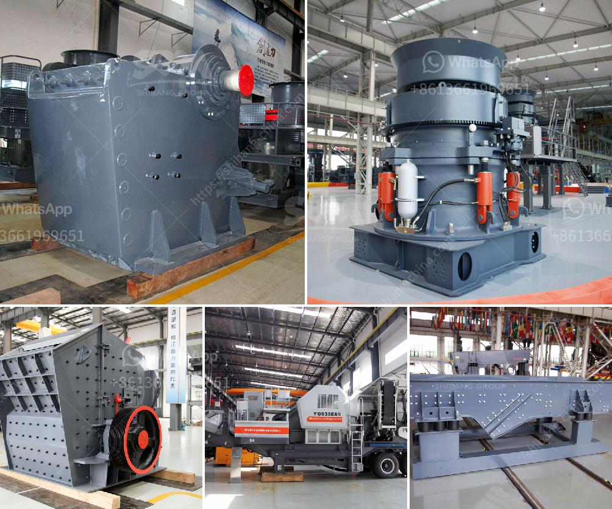

<h3>roks vertical mill</h3>
Milling, a fundamental process in the manufacturing industry, plays a crucial role in shaping various materials into the desired form. Over the years, technologies have evolved, and many innovative machines have been introduced to enhance precision, efficiency, and productivity in the milling process. Among these machines, ROK's Vertical Mill stands out as a game-changer, revolutionizing the world of milling.

The ROK's Vertical Mill is a cutting-edge milling machine that offers exceptional performance and versatility. It is designed to handle a wide range of materials, from metals to composites, allowing manufacturers to explore new possibilities and push the boundaries of creativity. With its advanced features and capabilities, this mill ensures precise and efficient milling operations, making it a powerful tool for industries across various sectors.

One of the standout features of ROK's Vertical Mill is its robust construction and exceptional stability. The machine is meticulously engineered with high-quality materials and components, making it highly reliable and durable. This stability is crucial when millers are dealing with intricate designs or complex parts that demand high accuracy. The vertical orientation of the machine further enhances stability, minimizing vibrations and ensuring consistent milling results.

Another key advantage of the ROK's Vertical Mill is its advanced control system, which enables operators to achieve unparalleled precision. The machine is equipped with state-of-the-art software, allowing users to program complex milling operations with ease. This level of control facilitates the creation of intricate designs and intricate parts, giving manufacturers a competitive edge in highly demanding industries.

Flexibility is also a notable aspect of the ROK's Vertical Mill. It offers a wide range of customizable features and accessories, allowing users to adapt the machine to meet their specific needs. Whether it's changing the spindle speed, adjusting the feed rate, or incorporating additional tooling, the ROK's Vertical Mill can be tailored to optimize productivity and achieve the desired results for each unique milling project.

In terms of productivity, the ROK's Vertical Mill excels by offering high-speed milling capabilities. With its powerful motor and efficient spindle, the machine can handle heavy-duty milling with ease, reducing downtime and increasing overall productivity. This enhanced productivity empowers manufacturers to meet tight deadlines and cater to the growing demands of the market effectively.

Moreover, ROK's Vertical Mill prioritizes safety in its design. The machine features various safety mechanisms, such as emergency stop buttons and protective enclosures, ensuring the well-being of operators and preventing potential accidents. This focus on safety further establishes ROK's Vertical Mill as a reliable choice for businesses seeking to maintain a secure work environment.

In conclusion, ROK's Vertical Mill has emerged as a game-changer in the world of milling, offering unparalleled performance, precision, and versatility. With its robust construction, advanced control system, flexibility, and focus on safety, this machine is empowering manufacturers across industries to achieve extraordinary results. As industries continue to evolve, ROK's Vertical Mill is undeniably at the forefront, driving progress and innovation in milling operations across the globe.
<h3>Contact us</h3><ul><li><strong>Whatsapp:&nbsp;<a href="https://wa.me/8613661969651">+8613661969651</a></strong></li><li><a href="https://swt.shibang-china.com/?git&amp;zhl&amp;roks vertical mill"><strong>Online Service(chat now)</strong></a></li></ul><h3>Related</h3><ul><li><a href='ore grinding mills china.md'>ore grinding mills china</a></li><li><a href='granite mining in zimbabwe.md'>granite mining in zimbabwe</a></li><li><a href='conventional stone crushers in peru.md'>conventional stone crushers in peru</a></li><li><a href='ball mill gypsum.md'>ball mill gypsum</a></li><li><a href='cost of conveyor belt system for coal loading.md'>cost of conveyor belt system for coal loading</a></li></ul>