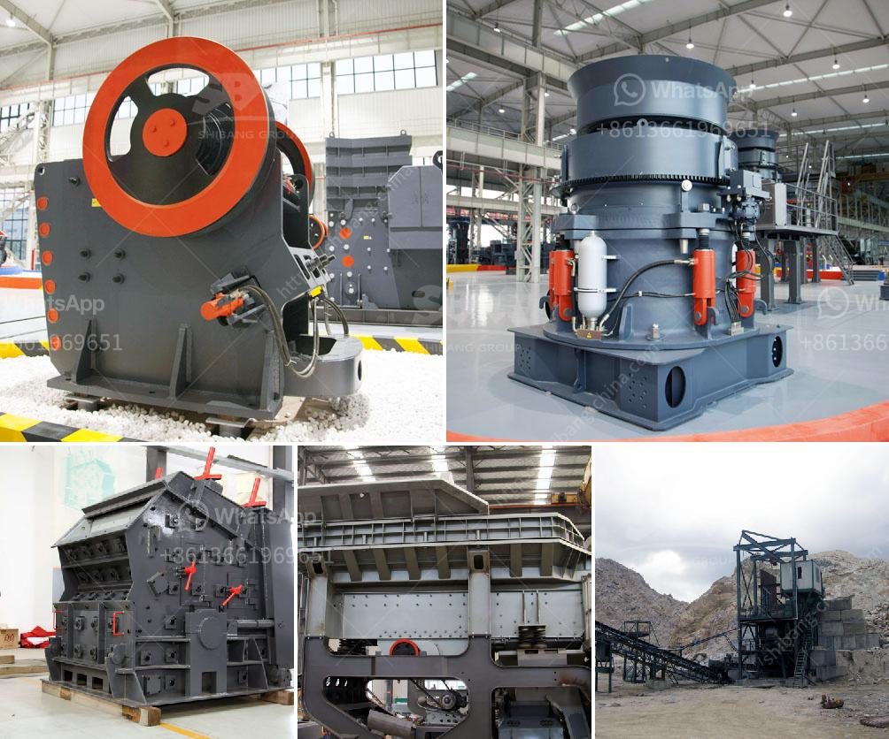

<h3>roller crusher seller</h3>
In the field of industrial machinery, the roller crusher seller plays a crucial role in providing desirable and efficient crushing solutions to various industries. With its unique design and mechanism, the roller crusher has become a popular choice for breaking down materials for further processing. This article aims to shed light on the benefits and features of roller crushers and highlights the importance of choosing a reliable roller crusher seller.

Roller crushers offer efficient crushing capabilities, making them an essential tool in industries such as mining, construction, and recycling. The roller crusher consists of two large cylinders with parallel axes and is often used for primary or secondary crushing. Its unique design allows for the uniform fragmentation of materials, ensuring a consistent product size.

The roller crusher's versatility is another reason for its popularity among industries. It can crush a wide range of materials, including limestone, coal, ores, clay, and even sticky materials. This flexibility enables industries to use roller crushers for various applications ranging from aggregate production to ore processing.

One of the advantages of roller crushers is their compact design, making them suitable for both stationary and mobile crushing plants. The reduced size allows for easy integration into existing processing setups or quick relocation to different sites. This flexibility is beneficial for industries where on-site crushing is required or when there is limited space for equipment installation.

Roller crushers are known for their energy efficiency, minimizing power consumption while yielding high productivity. The design of the crusher minimizes frictional forces and ensures optimal crushing performance, resulting in reduced energy requirements. This energy-saving feature not only reduces operational costs but also contributes to a greener and more sustainable industrial environment.

A trustworthy roller crusher seller understands the importance of providing durable machinery that requires minimal maintenance. This ensures prolonged equipment life and reduces downtime associated with repairs. Features such as easily replaceable wear parts and accessible maintenance points make roller crushers a reliable option for long-term use.

Selecting a reputable roller crusher seller is crucial to ensure the quality and reliability of the purchased equipment. There are several factors to consider when choosing a seller:

1. Reputation: Research the seller's reputation by reading customer reviews and testimonials. It is essential to choose a seller known for delivering high-quality and durable roller crushers.

2. Technical Expertise: Evaluate the seller's technical knowledge and expertise in the field of crushing machinery. A knowledgeable seller can provide valuable guidance on choosing the right roller crusher for specific applications.

3. After-sales Support: Select a seller that offers comprehensive after-sales support, including maintenance assistance, spare parts availability, and technical troubleshooting. This ensures a smooth operation and reduced downtime in case of any unexpected issues.

4. Customization: Look for a seller who can offer customized roller crushers tailored to the specific requirements of your operation. A customized crusher will ensure optimal performance and better meet your production needs.

A roller crusher seller plays a vital role in providing efficient crushing solutions to industries worldwide. The versatility, compact design, low energy consumption, and durability of roller crushers make them an excellent choice for various applications. When choosing a seller, considering factors such as reputation, technical expertise, after-sales support, and customization options will help ensure a reliable and long-lasting investment.
<h3>Contact us</h3><ul><li><strong>Whatsapp:&nbsp;<a href="https://wa.me/8613661969651">+8613661969651</a></strong></li><li><a href="https://swt.shibang-china.com/?git&amp;zhl&amp;roller crusher seller"><strong>Online Service(chat now)</strong></a></li></ul><h3>Related</h3><ul><li><a href='marble mining equipment.md'>marble mining equipment</a></li><li><a href='quarry crusher machine.md'>quarry crusher machine</a></li><li><a href='price and sales of quarry crusher in nigeria.md'>price and sales of quarry crusher in nigeria</a></li><li><a href='calcium carbonate mill.md'>calcium carbonate mill</a></li><li><a href='sand washing plant cost in india.md'>sand washing plant cost in india</a></li></ul>