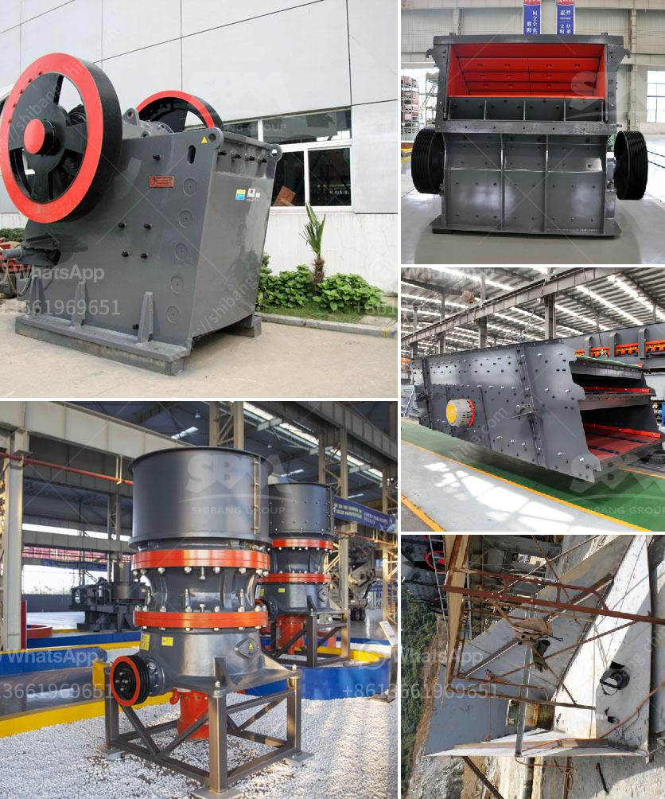

<h3>roller mill manufacturer</h3>
Roller mills are essential machines used in various industries to grind materials into a fine powder. They are commonly used in the production of cement, minerals, chemicals, and food products. With the increasing demand for efficient grinding solutions, roller mill manufacturers play a crucial role in meeting these needs.

One of the leading roller mill manufacturers in the market is XYZ Company. With years of experience and expertise, XYZ has established itself as a reliable provider of high-quality roller mills. Their commitment to innovation and technological advancements has made them a preferred choice for businesses across industries.

XYZ Company’s roller mills are known for their durability and performance. Constructed with sturdy materials and precision engineering, these machines can withstand heavy usage and deliver consistent results. This reliability ensures that businesses can maximize their productivity without worrying about frequent breakdowns or maintenance issues.

In addition to durability, XYZ Company’s roller mills are also designed for enhanced efficiency. These machines incorporate advanced grinding mechanisms and control systems to optimize the grinding process. With features such as automatic adjustment of roller pressure and speed, operators can achieve superior grinding performance with minimum effort. This not only saves time but also improves the overall quality of the final product.

Another notable feature of XYZ Company’s roller mills is their versatility. These machines can handle a wide range of materials, including but not limited to limestone, gypsum, clinker, and coal. The ability to grind different types of materials is crucial for industries that deal with various raw materials in their processes. XYZ Company’s roller mills offer the flexibility to cater to different requirements, making them suitable for a diverse range of applications.

Furthermore, XYZ Company is dedicated to providing excellent customer support. They have a team of experienced technicians who are available to assist clients with installation, maintenance, and troubleshooting. Their prompt response and effective solutions ensure that businesses can minimize downtime and maximize the lifespan of their roller mills.

In conclusion, roller mill manufacturers like XYZ Company play a vital role in meeting the grinding needs of various industries. Their commitment to producing durable, efficient, and versatile machines ensures that businesses can achieve their production goals effectively. With the continuous advancement of technology, roller mills are poised to become even more efficient and reliable, making them an invaluable asset for industries worldwide.
<h3>Contact us</h3><ul><li><strong>Whatsapp:&nbsp;<a href="https://wa.me/8613661969651">+8613661969651</a></strong></li><li><a href="https://swt.shibang-china.com/?git&amp;zhl&amp;roller mill manufacturer"><strong>Online Service(chat now)</strong></a></li></ul><h3>Related</h3><ul><li><a href='mobile crushers philippines.md'>mobile crushers philippines</a></li><li><a href='grinding balls in tanzania.md'>grinding balls in tanzania</a></li><li><a href='quartz manufacturing plant in tamilnadu.md'>quartz manufacturing plant in tamilnadu</a></li><li><a href='crusher machines for sale.md'>crusher machines for sale</a></li><li><a href='river stone crushing machine.md'>river stone crushing machine</a></li></ul>