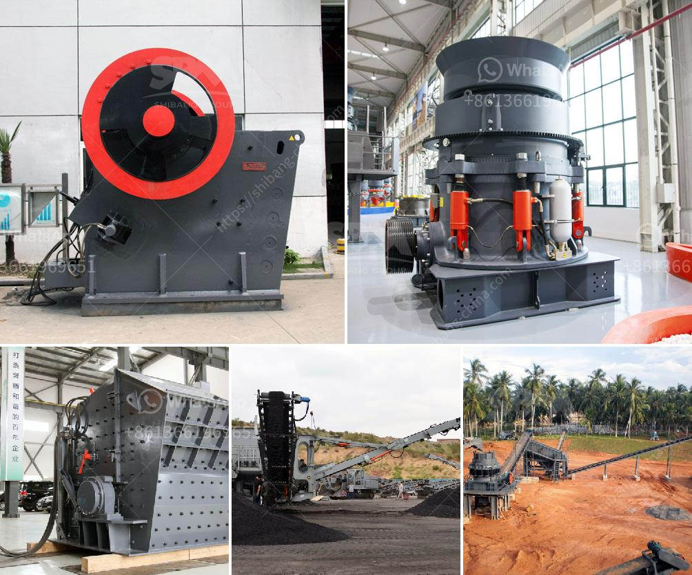

<h3>roller mill ultrafine</h3>
The grinding process in industries such as mining, construction, and chemical manufacturing plays a crucial role in producing fine powders or nano-sized particles. Traditionally, this process has been accomplished using a wide range of grinding mills, each with its own set of disadvantages. However, with the recent innovations in grinding technology, a new contender has emerged - the roller mill ultrafine.

The roller mill ultrafine is a piece of advanced machinery designed to grind materials into extremely fine powders. Unlike conventional grinding mills, which use traditional grinding media such as metal balls or rods, the roller mill ultrafine employs cylindrical rollers to exert pressure on the material being ground. This innovative design not only improves the grinding efficiency but also provides several other advantages that make it a game-changer in the industry.

One of the primary advantages of the roller mill ultrafine is its ability to achieve ultrafine grinding. It is specifically designed to produce particles with sizes ranging from a few micrometers to a few nanometers, meeting the demands of industries where precision and fineness are crucial. This makes it ideal for applications such as pharmaceuticals, pigments, and advanced materials, where the smallest particle size is required for enhanced performance.

Another noteworthy benefit of the roller mill ultrafine is its energy efficiency. Traditional grinding mills consume a significant amount of energy due to the collision and friction between the grinding media and the material being ground. The roller mill ultrafine, however, reduces energy consumption by up to 30% compared to its counterparts. This not only helps in reducing operational costs but also contributes to sustainable practices and lower carbon emissions.

Moreover, the roller mill ultrafine offers superior control over the grinding process, resulting in higher product quality and consistency. The adjustable pressure exerted by the cylindrical rollers allows operators to finely tune the grinding parameters, such as the particle size distribution and the specific surface area. This level of control ensures that the desired product characteristics are consistently achieved, meeting the stringent requirements of various industries.

In addition, the roller mill ultrafine has a compact design, making it space-saving and easy to integrate into existing production lines. Its modular construction allows for flexible customization, ensuring compatibility with different materials and processing requirements. Furthermore, the roller mill ultrafine requires minimal maintenance, reducing downtime and increasing overall productivity.

Despite its numerous advantages, the roller mill ultrafine faces some challenges as well. The high pressure exerted by the rollers requires robust construction, which may increase the initial investment cost. Additionally, the design complexity may require specialized expertise for installation and operation. However, considering the long-term benefits and improved performance, these challenges can be overcome with proper planning and support.

In conclusion, the roller mill ultrafine represents a significant advancement in grinding technology. With its ability to achieve ultrafine grinding, energy efficiency, superior control, and compact design, it is revolutionizing the way materials are processed in various industries. As advancements continue to be made, the roller mill ultrafine will continue to play a pivotal role in improving production capabilities and meeting the evolving demands of the modern world.
<h3>Contact us</h3><ul><li><strong>Whatsapp:&nbsp;<a href="https://wa.me/8613661969651">+8613661969651</a></strong></li><li><a href="https://swt.shibang-china.com/?git&amp;zhl&amp;roller mill ultrafine"><strong>Online Service(chat now)</strong></a></li></ul><h3>Related</h3><ul><li><a href='hammer mill machine 20hp.md'>hammer mill machine 20hp</a></li><li><a href='process of making diamonds from coal.md'>process of making diamonds from coal</a></li><li><a href='power calculation hammer mill equation.md'>power calculation hammer mill equation</a></li><li><a href='crusher power consumption.md'>crusher power consumption</a></li><li><a href='hopper harga untuk stone crusher.md'>hopper harga untuk stone crusher</a></li></ul>