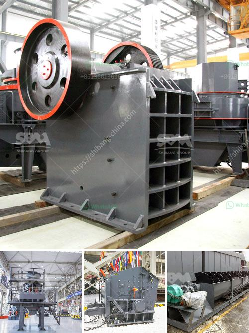

<h3>rolling mill process flow chart</h3>
A rolling mill is a versatile and efficient piece of equipment that increases the quality and precision of metal sheet and wire products. In this article, we will take a closer look at how this process works and outline the key steps and stages involved.

The process begins with a metal ingot or billet, which is heated above its recrystallization temperature in a furnace. This temperature is typically around 1100°C for steel and varies for different types of metals. The heating is crucial as it softens the metal and makes it easier to shape and mold.

Once the metal is heated to the desired temperature, it is then fed into the rolling mill. The mill consists of two large rolls that rotate in opposite directions, with the metal sandwiched between them. The distance between the two rolls, known as the roll gap, determines the thickness of the metal sheet or wire being produced.

As the metal passes through the roll gap, the rolls exert pressure on it, causing it to deform and reduce in thickness. This deformation process is known as rolling, and it is responsible for shaping the metal into the desired form. The rolls may also have grooves or patterns on their surface to produce specific textures or shapes on the metal.

After the initial pass through the rolls, the metal may need further reduction in thickness, which requires multiple passes. This is achieved by adjusting the roll gap between each pass to gradually decrease the thickness of the metal. The number of passes required depends on the desired final thickness and the initial thickness of the metal.

Throughout the rolling process, the metal may also go through other specialized operations such as stretching, tempering, or annealing. These operations help improve the mechanical properties of the metal, including its strength, hardness, and ductility. They may involve heating, cooling, or mechanical manipulation of the metal.

Once the desired thickness and properties are achieved, the metal exits the rolling mill in the form of a continuous sheet or wire. It then goes through further stages of processing such as cutting, shearing, or coiling, depending on the intended use or application.

The rolling mill process flow chart provides a visual representation of the steps and stages involved in producing metal sheet and wire products. By analyzing the chart, you can get a clear idea of the process and its efficiency. The flow chart also provides information on each operation, highlighting the sequence of events and the relationship between different stages.

In conclusion, the rolling mill process is a complex and challenging operation involving various stages and steps. Understanding the flow chart and its key components can help optimize the process and improve the quality and precision of the final product. With advancements in technology, rolling mills continue to evolve, offering enhanced capabilities and efficiency in the production of metal sheet and wire.
<h3>Contact us</h3><ul><li><strong>Whatsapp:&nbsp;<a href="https://wa.me/8613661969651">+8613661969651</a></strong></li><li><a href="https://swt.shibang-china.com/?git&amp;zhl&amp;rolling mill process flow chart"><strong>Online Service(chat now)</strong></a></li></ul><h3>Related</h3><ul><li><a href='conveyor belt kazakhstan.md'>conveyor belt kazakhstan</a></li><li><a href='gold ore hammer mills prices mining supplies in zimbabwe.md'>gold ore hammer mills prices mining supplies in zimbabwe</a></li><li><a href='crusher machines for sale.md'>crusher machines for sale</a></li><li><a href='mtm trapezium grinder mill.md'>mtm trapezium grinder mill</a></li><li><a href='how much would it cost to start a gravel quarry.md'>how much would it cost to start a gravel quarry</a></li></ul>