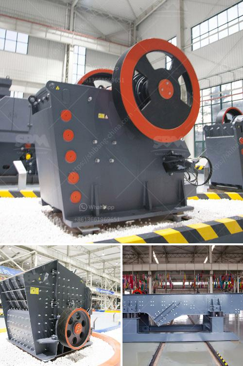

<h3>romania ball mill manufacturer</h3>
Ball mills have been widely used in the mining industry, chemical industry, and construction industry. Over the years, the Romanians have also greatly contributed to the development of ball mills worldwide. As a leading manufacturer, Romania ball mill manufacturer has a prominent market presence and offers a wide range of innovative products.

Romania, a country located in Eastern Europe, has a long history of industrialization. With its skilled labor force and advanced infrastructure, Romania has become a major player in the manufacturing sector. The country has successfully diversified its economy and developed expertise in various industries, including machinery and equipment manufacturing.

One of the notable players in this sector is the Romania ball mill manufacturer. By combining advanced technologies with a customer-centric approach, they have emerged as a global provider of innovative ball milling solutions. The company's primary focus is on providing reliable and efficient equipment that meets the evolving needs of their customers.

The Romania ball mill manufacturer offers a comprehensive range of ball mills for various applications. They are known for their exceptional quality and performance, ensuring that customers get the best possible results. The company's ball mills are designed with precision and built with high-quality materials to withstand the rigors of heavy-duty operations.

In addition to standard ball mill models, Romania ball mill manufacturer also offers custom-designed solutions. They work closely with their customers to understand their specific requirements and tailor their products accordingly. This level of flexibility sets them apart from their competitors and has earned them a reputation for exceptional customer service.

One of the key advantages offered by the Romania ball mill manufacturer is their commitment to innovation. They continuously invest in research and development to improve their existing products and develop new solutions. This allows them to stay ahead of the curve and meet the ever-changing demands of the industry.

Another noteworthy aspect of the Romania ball mill manufacturer is their focus on sustainability. They understand the importance of minimizing their carbon footprint and have implemented various measures to reduce energy consumption and optimize resource utilization. By implementing these green practices, they contribute to building a more sustainable future for the manufacturing industry.

Furthermore, the Romania ball mill manufacturer has a strong distribution network, ensuring that their products reach customers across the globe. They have established partnerships with reputable distributors, enabling them to provide efficient and timely support to their customers worldwide.

In conclusion, the Romania ball mill manufacturer is a leading provider of innovative ball milling solutions. With their commitment to quality, customer-centric approach, and focus on sustainability, they have positioned themselves as a trusted partner for industries requiring ball mills. Their dedication to innovation and continuous improvement sets them apart from their competitors and makes them a preferred choice for customers seeking reliable and efficient equipment.
<h3>Contact us</h3><ul><li><strong>Whatsapp:&nbsp;<a href="https://wa.me/8613661969651">+8613661969651</a></strong></li><li><a href="https://swt.shibang-china.com/?git&amp;zhl&amp;romania ball mill manufacturer"><strong>Online Service(chat now)</strong></a></li></ul><h3>Related</h3><ul><li><a href='how to make marble powder statues.md'>how to make marble powder statues</a></li><li><a href='portable jaw crushers.md'>portable jaw crushers</a></li><li><a href='mobile crusher plant prices.md'>mobile crusher plant prices</a></li><li><a href='cone crushers for sale.md'>cone crushers for sale</a></li><li><a href='mica powder manufacturers machinery.md'>mica powder manufacturers machinery</a></li></ul>