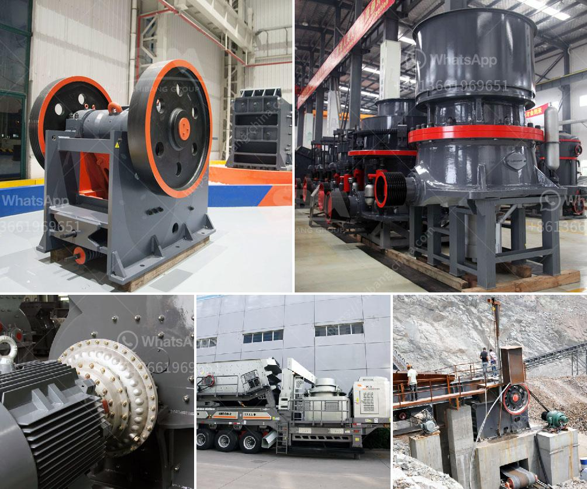

<h3>rumus perhitungan kapasitas jaw crusher</h3>
Rumus perhitungan kapasitas jaw crusher merupakan salah satu perhitungan dasar dalam industri pemecahan batu. Jaw crusher merupakan mesin yang digunakan untuk menghancurkan batu menjadi ukuran lebih kecil. Dalam penggunaan jaw crusher, kapasitas merupakan faktor penting yang harus diperhatikan agar kinerja mesin dapat optimal.

Rumus perhitungan kapasitas jaw crusher dapat dibedakan menjadi dua jenis, yaitu rumus perhitungan kapasitas jaw crusher berdasarkan pengalaman dan rumus perhitungan kapasitas jaw crusher berdasarkan teori. Perhitungan kapasitas jaw crusher berdasarkan pengalaman merupakan perhitungan yang didasarkan pada pengalaman pengguna atau produsen mesin. Sedangkan perhitungan kapasitas jaw crusher berdasarkan teori didasarkan pada pengetahuan dan rumus-rumus yang ada.

Rumus perhitungan kapasitas jaw crusher berdasarkan pengalaman umumnya menggunakan faktor-faktor seperti luas bukaan penerimaan, kecepatan operasi, ukuran makanan, kekerasan bahan, dan pengaturan keluaran. Faktor-faktor ini dijadikan acuan untuk menghitung kapasitas mesin dalam satu jam atau satu hari kerja. Rumus perhitungan kapasitas jaw crusher berdasarkan teori lebih kompleks karena melibatkan rumus fisika dan dinamika material.

Salah satu rumus perhitungan kapasitas jaw crusher berdasarkan teori adalah rumus yang digunakan oleh Rittinger, yaitu:

Rumus ini dapat diaplikasikan dalam perhitungan kapasitas jaw crusher dengan memasukkan nilai-nilai yang relevan. Namun, rumus ini hanya memberikan perkiraan kasar dan perlu dikalibrasi dengan hasil pengujian aktual.

Dalam menghitung kapasitas jaw crusher, faktor-faktor seperti keausan gigi rahang, tegangan atau tekanan operasi, serta efisiensi pendinginan mesin juga perlu diperhatikan. Semakin tinggi keausan gigi rahang, maka kapasitas jaw crusher juga akan menurun. Tekanan operasi yang tidak tepat juga dapat menyebabkan pengurangan kapasitas karena dapat menghancurkan batu dengan kecepatan yang berlebihan. Efisiensi pendinginan mesin juga mempengaruhi kapasitas jaw crusher karena suhu yang tinggi dapat mengurangi kinerja mesin secara keseluruhan.

Dalam industri pemecahan batu, mesin jaw crusher sangat dibutuhkan karena dapat menghasilkan batu pecahan dengan berbagai ukuran yang dibutuhkan. Untuk itu, perhitungan kapasitas jaw crusher menjadi penting agar mesin dapat bekerja dengan optimal. Dengan menggunakan rumus perhitungan yang tepat, perusahaan dapat mengoptimalkan kapasitas jaw crusher dan meningkatkan produktivitas serta efisiensi kerja.
<h3>Contact us</h3><ul><li><strong>Whatsapp:&nbsp;<a href="https://wa.me/8613661969651">+8613661969651</a></strong></li><li><a href="https://swt.shibang-china.com/?git&amp;zhl&amp;rumus perhitungan kapasitas jaw crusher"><strong>Online Service(chat now)</strong></a></li></ul><h3>Related</h3><ul><li><a href='ball mill gypsum.md'>ball mill gypsum</a></li><li><a href='ball mills in monterrey.md'>ball mills in monterrey</a></li><li><a href='nigeria minerals crusher processing company.md'>nigeria minerals crusher processing company</a></li><li><a href='portable gold rock crushing machine.md'>portable gold rock crushing machine</a></li><li><a href='list of sponge iron factories in hospet.md'>list of sponge iron factories in hospet</a></li></ul>