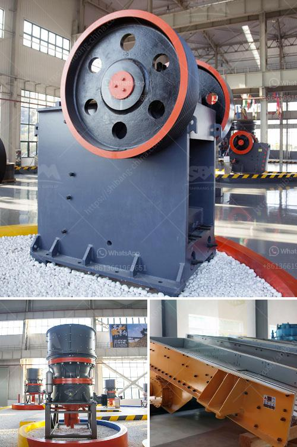

<h3>rumus tegangan pada belt conveyor</h3>
A belt conveyor is an essential piece of equipment used in various industries to transport goods and materials from one location to another. It is a versatile and efficient method of moving heavy or bulky items, making it a crucial part of modern industrial operations.

To ensure the efficiency and safety of belt conveyors, it is necessary to understand the concept of tension or rumus tegangan pada belt conveyor. Tension refers to the force applied to the conveyor belt to move the materials along the system. It is crucial to maintain the right tension to prevent belt slippage, material spillage, and excessive wear and tear.

The fundamental principle of rumus tegangan pada belt conveyor is based on the relationship between the tension force, the weight of the conveyed material, and the frictional forces acting on the belt. By understanding these factors, conveyor operators can calculate the appropriate tension to be applied for smooth and reliable operations.

The rumus tegangan pada belt conveyor involves several variables, including the belt tension, the belt width, the coefficient of friction between the belt and the material being conveyed, the angle of inclination, and the weight of the conveyed material. By considering these variables, operators can determine the required tension to achieve optimal performance.

One common formula used to calculate the belt tension is the Maximum Belt Tension Formula. This formula takes into account the maximum tensile strength of the belt material, the angle of wrap around the pulley, and the coefficient of friction between the belt and the pulley surface. By plugging in these values, operators can determine the maximum tension the belt can withstand without causing damage or failure.

Another important factor to consider is the belt tension required to overcome the resistance forces acting on the conveyor system. These forces include the frictional resistance between the belt and the idlers, the resistance due to the weight of the conveyed material, and any external forces such as wind or vibrations. By estimating these resistance forces, operators can adjust the belt tension to ensure smooth and efficient operations.

It is worth noting that rumus tegangan pada belt conveyor calculations are not fixed and may vary depending on the specific application and industry requirements. Different materials, incline angles, belt widths, and operating conditions can affect the ideal tension for a belt conveyor system. Therefore, it is essential for conveyor operators to consult industry standards, guidelines, and manufacturers' recommendations to determine the appropriate tension for their specific requirements.

In conclusion, rumus tegangan pada belt conveyor is a critical aspect of maintaining the efficiency and safety of belt conveyor systems. By understanding the various factors and using the appropriate formulas, operators can ensure the right tension is applied for optimal performance. Regular monitoring and adjustment of the belt tension are also necessary to prevent slippage, material spillage, and premature wear on the conveyor components. With proper maintenance and attention to tension, belt conveyors can continue to play a vital role in various industries' operations.
<h3>Contact us</h3><ul><li><strong>Whatsapp:&nbsp;<a href="https://wa.me/8613661969651">+8613661969651</a></strong></li><li><a href="https://swt.shibang-china.com/?git&amp;zhl&amp;rumus tegangan pada belt conveyor"><strong>Online Service(chat now)</strong></a></li></ul><h3>Related</h3><ul><li><a href='aggregate quarry crusher philippines.md'>aggregate quarry crusher philippines</a></li><li><a href='used jaw mobile crusher in uae.md'>used jaw mobile crusher in uae</a></li><li><a href='brand new cone crusher for sale india.md'>brand new cone crusher for sale india</a></li><li><a href='cost of lime stone crusher plant.md'>cost of lime stone crusher plant</a></li><li><a href='coal roller mill.md'>coal roller mill</a></li></ul>