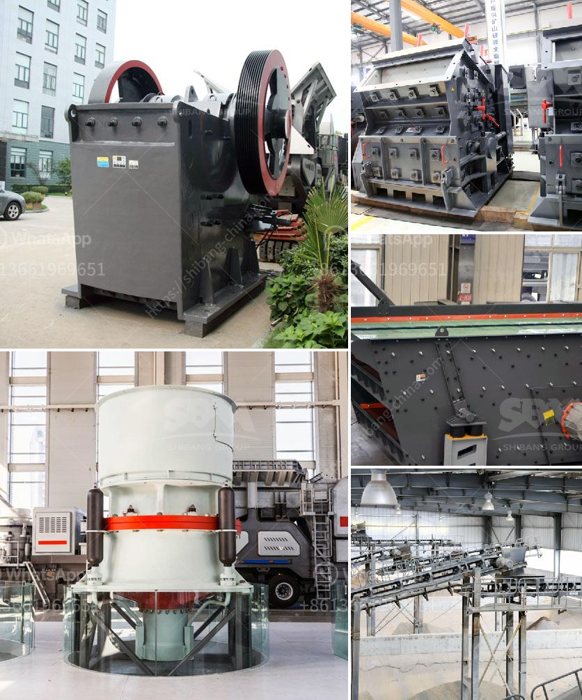

<h3>sample busines project proposal for stone crusher</h3>
Every year, the construction industry generates billions of dollars of revenue from roads, bridges, and buildings. It is also essential to consider that from a long-term perspective, the stone crushing industry is pivotal for supplying necessary construction materials to the construction sites. Therefore, any aspiring entrepreneur who intends to join this industry must ensure that their stone crushing plant is capital intensive, efficient, and profitable to realize financial growth.

This sample business project proposal for stone crusher is perfect for any aspiring entrepreneur that wants to create a sustainable yet highly profitable business project. With a production capacity of over 1o tonnes per hour since project is a medium scale project, the supply will be sufficient to meet the requirements of the project and the local market. This business project will also provide employment opportunities for the local community. Therefore, the project will have a positive economic and social impact on the local community.

The scope of the project can be expanded to increase production capacity if required and when the demand for additional crushed stones increases. The project can easily be modified to suit the user's specific requirements as it will be a custom-built project designed to meet the professional needs of the establishment.

The project aims to establish a stone crushing unit in rural area of Acra, in the Pena region. The unit will be able to produce 2,500 metric tons of crushed stones of various sizes per day.

The stone crushing unit will be installed on the agricultural land of Zemanat, with a total area of 12,000 square meters. Acquisition of the land, equipment, and machinery will be funded through a long-term commercial loan from the bank. The loan proposal has been submitted and approval is expected within a month.

The project will require a total investment of $3,500,000. The funding will be allocated to equipment procurement, construction, installation, and financing of operational costs.

The project will be executed in two phases. Phase one will include the construction of the stone crushing unit itself, including installation of equipment such as crushers and screens. Phase two will involve the establishment of asphalt and concrete batching plants nearby to further enhance the value chain.

The stone crushing unit will generate employment opportunities for around 45 individuals including management personnel. Once operational, the project will have a positive impact on the local economy by generating revenue and taxes for the government. Furthermore, the project will also contribute to local infrastructure development as it will require a network of roads and utilities for its operation.

The project will adhere to strict environmental protection measures to minimize pollution and negative impacts on the environment. Dust suppression systems will be installed at various points to reduce dust emissions. Noise levels will be kept within permissible limits by installing silencers on equipment. Waste management practices will include recycling and proper disposal of waste to reduce the environmental impact.

In conclusion, this business project proposal for stone crusher has been created to provide investment opportunities very profitable to the investors. The focus of this project is to create employment opportunities, generate profits, and contribute to the development of infrastructure. With its strategic location and strong market demand, this venture promises potential growth and long-term financial stability.
<h3>Contact us</h3><ul><li><strong>Whatsapp:&nbsp;<a href="https://wa.me/8613661969651">+8613661969651</a></strong></li><li><a href="https://swt.shibang-china.com/?git&amp;zhl&amp;sample busines project proposal for stone crusher"><strong>Online Service(chat now)</strong></a></li></ul><h3>Related</h3><ul><li><a href='gravel screening equipment.md'>gravel screening equipment</a></li><li><a href='ball mill in turkey.md'>ball mill in turkey</a></li><li><a href='quartz processing machine.md'>quartz processing machine</a></li><li><a href='price hammer crusher nigeria.md'>price hammer crusher nigeria</a></li><li><a href='brand new cone crusher for sale india.md'>brand new cone crusher for sale india</a></li></ul>