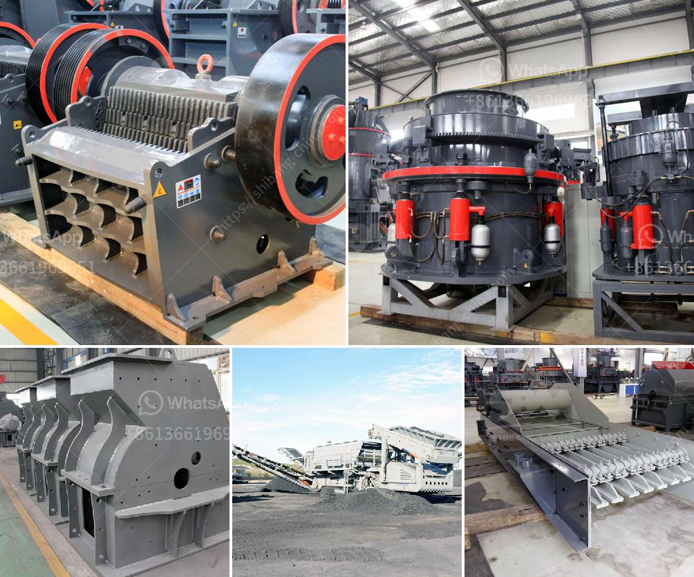

<h3>sample of gold mining business plan in ghana</h3>
Ghana’s mining industry contributes around 37% to the country’s total exports. As a result of this, there are quite a number of mining companies in Ghana that are making a great fortune. Gold alone contributes up to 90% of the mineral exports in the country. The number of gold mining companies Ghana amounts to more than 23.

This makes mining companies gold exploration activities some of the busiest in the region. Minerals in Ghana seem to be immune to the downturn in the global mining industry as they continue to attract major and small-scale investors.

Gold mining companies are a major source of income and economic growth, with an important role in supporting sustainable socio-economic development. During 2019, gold mining companies in Ghana supported about 36,450 jobs, directly and indirectly.

The gold mine plan we will examine here is for a medium-sized mining operation targeting an annual production of 100,000 ounces over a 10-year period. The deposit is estimated to contain 2.1 million ounces of proven and probable gold reserves.

The business plan demonstrates the company’s mining and production capabilities in relation to the chosen mine site, emphasizing the potential viability of the project. It includes detailed schedules of quantities and production processes, showcasing the technological advancements employed to extract gold efficiently.

Furthermore, the business plan presents financial forecasts based on extensive market research and analysis of gold prices, laying out the projected revenue, profit, and cash flow for the mine’s lifespan. It also outlines a comprehensive environmental assessment and safety measures, ensuring compliance with Ghana’s mining laws and regulations.

The success of a business plan for gold mining in Ghana relies upon adequate planning, execution, and regular monitoring. The industry continually adapts to new technological advancements and fluctuating market conditions. Nonetheless, with the right strategies in place, Ghana’s lucrative gold mining industry will continue to flourish, benefiting local communities and the nation's economy as a whole.
<h3>Contact us</h3><ul><li><strong>Whatsapp:&nbsp;<a href="https://wa.me/8613661969651">+8613661969651</a></strong></li><li><a href="https://swt.shibang-china.com/?git&amp;zhl&amp;sample of gold mining business plan in ghana"><strong>Online Service(chat now)</strong></a></li></ul><h3>Related</h3><ul><li><a href='small sand washing machine.md'>small sand washing machine</a></li><li><a href='crusher for sale in dubai.md'>crusher for sale in dubai</a></li><li><a href='conveyor belt equipment for mining south africa.md'>conveyor belt equipment for mining south africa</a></li><li><a href='alluvial gold mining in zimbabwe.md'>alluvial gold mining in zimbabwe</a></li><li><a href='coal washing plant cost.md'>coal washing plant cost</a></li></ul>