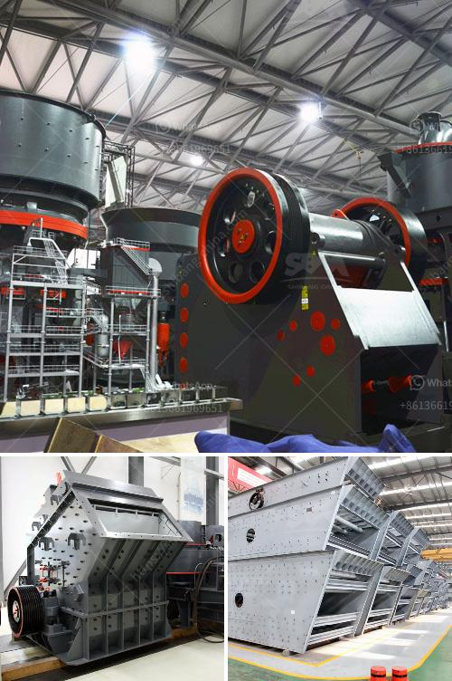

<h3>sample of project proposal on small scale mining</h3>
Small-scale mining is a significant sector in the mining industry. It is a vital source of employment, revenue generation, and community development, particularly in rural areas. These operations utilize basic tools and techniques to extract minerals or precious stones that can be sold in local and international markets. However, despite its contribution to the economy, small-scale mining faces numerous challenges, including environmentally damaging practices and inadequate resources for sustainable development.

The main objective of this project is to develop and implement sustainable small-scale mining practices in a specific community. The project aims to enhance miners' livelihoods while minimizing the negative social, economic, and environmental impacts associated with small-scale mining activities.

1. Capacity Building: The project will conduct training sessions to enhance miners' knowledge and skills in responsible mining practices, efficient mineral processing techniques, and occupational health and safety standards. This will enable them to extract minerals in a sustainable and socially responsible manner, improving their productivity and income.

2. Community Engagement: Active engagement with local communities is crucial for the success of this project. It will involve consultations, partnerships, and the establishment of community-based organizations to encourage ownership and long-term commitment to sustainable small-scale mining practices. This will also foster a sense of responsibility and shared benefits among community members.

3. Environmental Management: The project will focus on implementing environmentally friendly mining practices, such as proper waste management, reforestation, and erosion control measures. This will reduce the negative environmental impacts caused by small-scale mining, including deforestation, water pollution, and land degradation.

4. Access to Finance: Most small-scale miners face challenges in accessing finance and capital for their operations. This project will establish financial mechanisms, such as microcredit facilities and cooperative savings schemes, to provide affordable and accessible financing options for miners. This will enable them to improve their equipment, infrastructure, and overall operations.

1. Improved Livelihoods: By adopting sustainable mining practices and improving productivity, small-scale miners will experience increased incomes and improved living conditions. This will contribute to poverty reduction and economic growth in the community.

2. Environmental Protection: Through responsible mining practices and environmental management initiatives, the project will contribute to the conservation and protection of natural resources, ensuring their availability for future generations.

3. Social Development: The project will promote better working conditions for miners, including enhanced occupational health and safety standards. It will also encourage the inclusion of women and marginalized groups in small-scale mining activities, fostering gender equality and social equity.

4. Sustainable Mining Practices: The project aims to create a model for sustainable small-scale mining that can be replicated in other communities. Knowledge sharing and lessons learned will be disseminated to relevant stakeholders, including government agencies, NGOs, and the mining industry.

This project proposal outlines the importance of promoting sustainable small-scale mining practices. By enhancing miners' capacity, engaging with local communities, implementing environmental management strategies, and addressing financial constraints, this project can contribute to the development of responsible mining practices that benefit both miners and the environment. With the commitment and collaboration of all stakeholders involved, the small-scale mining sector can make significant strides towards sustainability and long-term economic viability.
<h3>Contact us</h3><ul><li><strong>Whatsapp:&nbsp;<a href="https://wa.me/8613661969651">+8613661969651</a></strong></li><li><a href="https://swt.shibang-china.com/?git&amp;zhl&amp;sample of project proposal on small scale mining"><strong>Online Service(chat now)</strong></a></li></ul><h3>Related</h3><ul><li><a href='rock crusher plant operations manager.md'>rock crusher plant operations manager</a></li><li><a href='used stone crusher in ontario.md'>used stone crusher in ontario</a></li><li><a href='spare parts dealer of crusher plant in odisha.md'>spare parts dealer of crusher plant in odisha</a></li><li><a href='mobile crushing station.md'>mobile crushing station</a></li><li><a href='ballast crusher kenya.md'>ballast crusher kenya</a></li></ul>