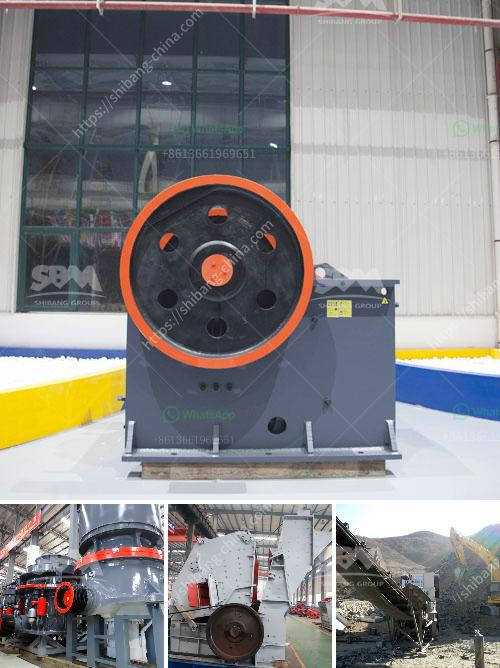

<h3>sand and gravel crusher suppliers located in cebu</h3>
Sand and gravel are essential materials in construction and landscaping projects. These materials are commonly used as a base for paving, as backfill, and in the production of concrete. To ensure a steady supply of these materials, it is important to have reliable crusher suppliers located in Cebu.

Cebu is the fastest-growing province in the Philippines, and its bustling construction industry requires high-quality sand and gravel materials. Crusher suppliers in Cebu contribute to this thriving industry by providing the highest quality materials needed for these projects.

One of the popular crusher suppliers in Cebu is F & G Sand and Gravel. This company offers a wide range of sand and gravel products, including aggregates, recycled concrete, and asphalt. They also offer demolition services for residential and commercial properties.

F & G Sand and Gravel has been in the industry for years, and their experience and expertise make them a trusted supplier in the Cebu region. They have a dedicated team of professionals who ensure that their products meet the highest quality standards. They also have the necessary equipment to process and produce large quantities of sand and gravel efficiently.

Another reputable crusher supplier in Cebu is MCDL Aggregates. This company produces high-quality sand and gravel materials for various construction and landscaping projects. They have a wide range of products, including crushed rock, washed sand, and decorative stones. MCDL Aggregates caters to both residential and commercial clients, providing them with the materials they need for their specific projects.

One of the advantages of choosing crusher suppliers in Cebu is their proximity to construction sites. Having local suppliers helps to reduce transportation costs and ensures a steady supply of materials. This is especially important for large-scale projects that require a significant amount of sand and gravel.

In addition to F & G Sand and Gravel and MCDL Aggregates, there are several other crusher suppliers in Cebu that provide high-quality materials to the construction industry. These suppliers play a vital role in meeting the demands of the booming construction sector in the province.

With the increasing demand for construction materials, it is crucial to have reliable crusher suppliers in Cebu. These suppliers ensure that the construction industry has access to the necessary materials for their projects. Their commitment to quality and efficiency helps to drive the growth and development of the province.

In conclusion, sand and gravel crusher suppliers located in Cebu are essential for the construction industry. They provide high-quality materials needed for various projects, ensuring the steady supply of sand and gravel. With their experience, expertise, and proximity to construction sites, these suppliers play a crucial role in meeting the demands of the booming construction sector in Cebu.
<h3>Contact us</h3><ul><li><strong>Whatsapp:&nbsp;<a href="https://wa.me/8613661969651">+8613661969651</a></strong></li><li><a href="https://swt.shibang-china.com/?git&amp;zhl&amp;sand and gravel crusher suppliers located in cebu"><strong>Online Service(chat now)</strong></a></li></ul><h3>Related</h3><ul><li><a href='mobile stone crusher price ph.md'>mobile stone crusher price ph</a></li><li><a href='iron crushing machine for sale.md'>iron crushing machine for sale</a></li><li><a href='equipments of copper processing.md'>equipments of copper processing</a></li><li><a href='second hand mobile crushers and screens south africa.md'>second hand mobile crushers and screens south africa</a></li><li><a href='stone quarries in mpumalanga.md'>stone quarries in mpumalanga</a></li></ul>