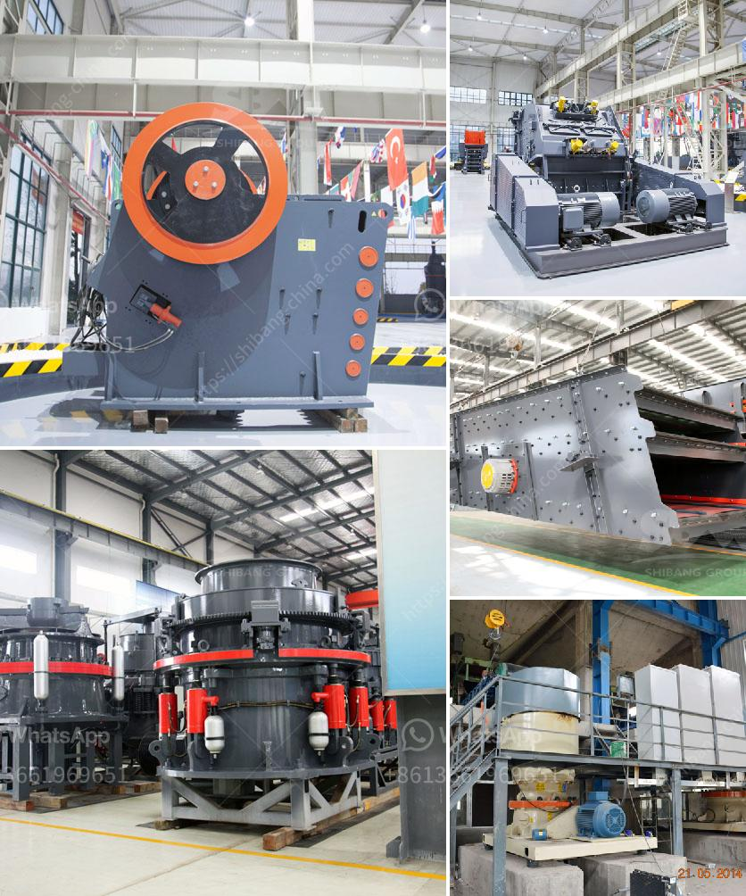

<h3>sand business plan</h3>
Sand is a valuable natural resource that is in high demand worldwide. Its diverse applications make it an essential component in the construction, manufacturing, and agriculture industries. With the ever-increasing urbanization and population growth, the demand for sand is expected to rise considerably in the coming years. Starting a sand business can be a lucrative and sustainable venture with proper planning and execution.

To begin with, conducting a thorough market analysis is essential. Identify the target market and understand the specific requirements and preferences of potential customers. This could range from construction companies and contractors to glass manufacturers and horticultural businesses. Research the current market trends, competition, and pricing strategies adopted by existing players to develop a competitive edge.

Next, assess the availability and accessibility of sand in your area. The type and quality of sand required for various applications may differ, so ensure you can meet the specific demands of your target market. Consider sourcing sand from rivers, quarries, or other reliable suppliers. Establish partnerships with local sand suppliers to ensure a steady supply while maintaining quality standards.

Obtaining the necessary licenses and permits is crucial for a sand business. Research the regulations and environmental policies governing the extraction and trade of sand in your region. Engage with local authorities and obtain the required permits to operate legally and sustainably. Adhering to environmental regulations will not only ensure a smooth operation but also contribute to building a positive reputation for your business.

Develop a detailed business plan that outlines your objectives, marketing strategies, financial projections, and operational procedures. Identify the key personnel and skill sets required to run the business efficiently. If necessary, consider hiring professionals experienced in sand extraction and trade to leverage their expertise.

Invest in the right equipment and machinery for sand extraction, storage, and transportation. This may include excavators, loaders, trucks, and conveyor belts. It is essential to choose machinery that is energy-efficient and capable of handling different types of sand efficiently. Regular maintenance and proper handling of machinery will maximize productivity and reduce downtime.

Implement sustainable practices in your sand business. Minimize the ecological impact by adopting responsible mining methods, such as controlling erosion, water usage, and reclamation of mining sites. Explore opportunities to use renewable energy sources to power your operations. Emphasize recycling and reusing sand whenever possible.

Marketing and promotion are crucial for the success of your sand business. Develop a strong online presence by creating a website and utilizing social media platforms to showcase your products, share industry-related information, and engage with customers. Participate in trade shows, industry events, and network with potential buyers to expand your customer base.

Finally, prioritize customer satisfaction and quality assurance. Provide reliable and prompt delivery services to build trust and long-lasting relationships with customers. Ensure consistent product quality by implementing quality control measures and conducting regular testing. Be open to feedback and continually strive to improve your products and services.

In conclusion, the sand business offers immense potential for profitability and sustainability. By conducting thorough market research, obtaining the necessary licenses, and implementing responsible practices, entrepreneurs can establish a successful venture. With the rising demand for sand, a well-executed sand business plan can create a steady revenue stream, suitable for long-term growth and prosperity.
<h3>Contact us</h3><ul><li><strong>Whatsapp:&nbsp;<a href="https://wa.me/8613661969651">+8613661969651</a></strong></li><li><a href="https://swt.shibang-china.com/?git&amp;zhl&amp;sand business plan"><strong>Online Service(chat now)</strong></a></li></ul><h3>Related</h3><ul><li><a href='calcite ball milling equipment.md'>calcite ball milling equipment</a></li><li><a href='hard rock quarry crusher in libya.md'>hard rock quarry crusher in libya</a></li><li><a href='crusher power consumption.md'>crusher power consumption</a></li><li><a href='used raymond mill for sale in taiwan crusher.md'>used raymond mill for sale in taiwan crusher</a></li><li><a href='new gypsum board plant in india.md'>new gypsum board plant in india</a></li></ul>