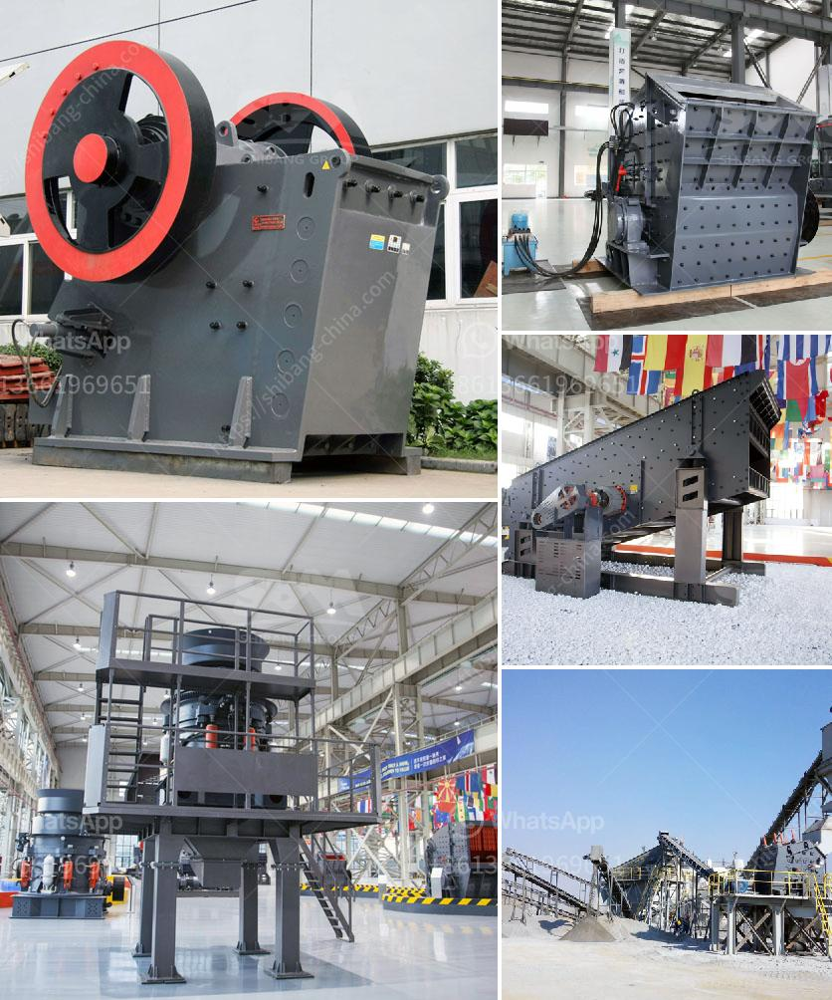

<h3>sand crusher price</h3>
Sand crusher is a common equipment in the construction industry and its price varies depending on different factors. With the rapid growth of construction industry, the demand for sand and gravel resources is increasing. To meet the market demand, sand crusher manufacturers have expanded the scale of production to ensure sufficient supply of sand and gravel aggregate.

The price of sand crusher is influenced by different factors such as product quality, specifications, production capacity, and market competition. First, the product quality plays a significant role in determining the price. A high-quality sand crusher is usually made of high-quality materials and advanced technology, which ensures its durability and stable performance. Therefore, the price of a high-quality sand crusher tends to be higher than that of ordinary ones.

Second, the specifications of the sand crusher also affect its price. Generally, sand crushers with larger specifications have higher prices because they have larger production capacity and higher working efficiency. Moreover, sand crushers with more advanced features and functions may have higher prices as well.

Third, the production capacity of the sand crusher is another factor that affects its price. A sand crusher with a larger production capacity means higher output and faster production speed, which usually leads to a higher price.

Last but not least, market competition also has an impact on the price of sand crusher. In a highly competitive market, manufacturers may lower the price of their sand crushers to attract more customers and gain a competitive advantage. On the other hand, manufacturers with a well-established reputation may charge higher prices due to their brand influence.

In conclusion, the price of sand crusher is determined by several factors, including product quality, specifications, production capacity, and market competition. Customers should consider their own needs and budget when choosing a sand crusher, and compare the prices and features of different models to make an informed decision.
<h3>Contact us</h3><ul><li><strong>Whatsapp:&nbsp;<a href="https://wa.me/8613661969651">+8613661969651</a></strong></li><li><a href="https://swt.shibang-china.com/?git&amp;zhl&amp;sand crusher price"><strong>Online Service(chat now)</strong></a></li></ul><h3>Related</h3><ul><li><a href='price pe 600 and 900 stone crusher.md'>price pe 600 and 900 stone crusher</a></li><li><a href='pf trituradora de impacto.md'>pf trituradora de impacto</a></li><li><a href='jaw crushers machine for sale.md'>jaw crushers machine for sale</a></li><li><a href='cement plant for sale intpd.md'>cement plant for sale intpd</a></li><li><a href='silica sand ball mill.md'>silica sand ball mill</a></li></ul>