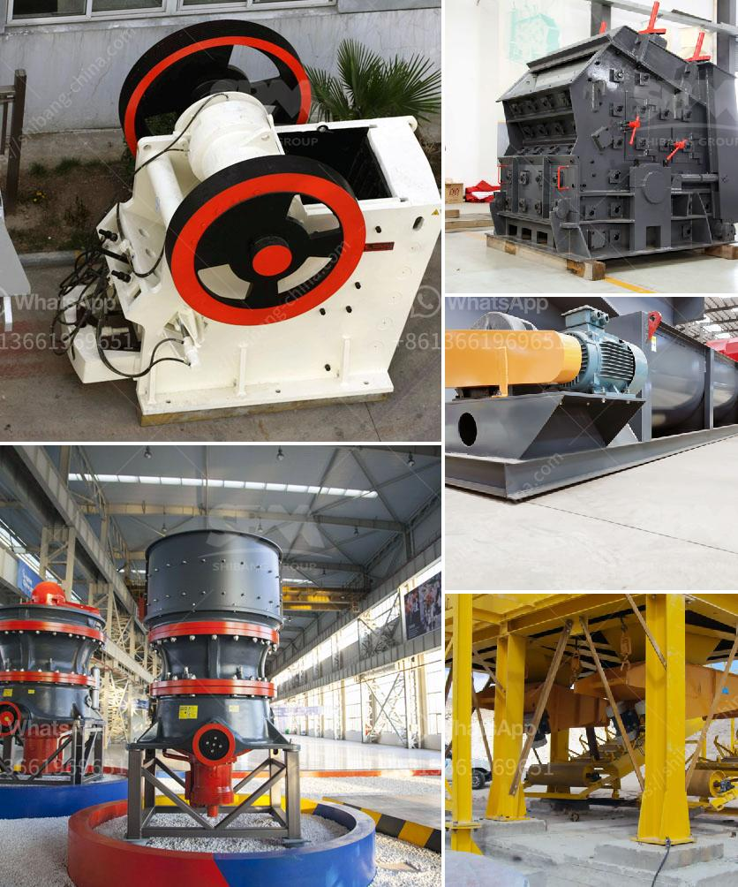

<h3>sand hand bentonite grinding mill</h3>
In the realm of industrial grinding equipment, the sand hand bentonite grinding mill has emerged as a prominent player due to its exceptional efficiency and versatility. This innovative machinery is designed to grind and pulverize various materials, enabling manufacturing processes to be streamlined and optimized. With its ability to handle sand and bentonite, this grinding mill has become a go-to solution for industries such as construction, mining, and metallurgy.

The sand hand bentonite grinding mill stands apart from traditional grinding mills due to its ability to efficiently handle a wide range of materials. Within its compact design, it incorporates a powerful motor and a specialized grinding mechanism that ensures consistent and reliable results. Whether it is sand particles, bentonite clay, or aggregates, this grinding mill is capable of converting them into fine powders of varying fineness.

The sand hand bentonite grinding mill finds immense utility in the construction industry. It can process sand, gravel, and stone aggregates, ensuring a consistent size and texture for various applications. Construction companies rely on this mill to pulverize sand in the production of concrete mixtures, asphalt, and cement. The grinding mill also plays a significant role in the mining sector, where it processes bentonite clay into powders that are used in drilling fluids for oil and gas extraction.

Manufacturers of the sand hand bentonite grinding mill prioritize ease of maintenance and durability. The machinery is designed to withstand the high demands of industrial settings. Regular maintenance routines ensure optimal performance and extend the lifespan of the grinding mill, minimizing downtime and maximizing productivity.

The sand hand bentonite grinding mill has revolutionized the grinding process in various industries. With its ability to handle sand particles and bentonite clay, it offers a versatile solution for manufacturers seeking efficiency and reliability. From construction to mining applications, this grinding mill plays a pivotal role in enhancing productivity and streamlining manufacturing processes. By staying committed to regular maintenance, users can prolong the lifespan of the machinery and ensure consistent performance for years to come.
<h3>Contact us</h3><ul><li><strong>Whatsapp:&nbsp;<a href="https://wa.me/8613661969651">+8613661969651</a></strong></li><li><a href="https://swt.shibang-china.com/?git&amp;zhl&amp;sand hand bentonite grinding mill"><strong>Online Service(chat now)</strong></a></li></ul><h3>Related</h3><ul><li><a href='alluvial mining wash plant in canada.md'>alluvial mining wash plant in canada</a></li><li><a href='stone crushing machine price in india.md'>stone crushing machine price in india</a></li><li><a href='alluvial gold mining machines.md'>alluvial gold mining machines</a></li><li><a href='ball mill in zimbabwe.md'>ball mill in zimbabwe</a></li><li><a href='crusher plant in jizan saudi arabia.md'>crusher plant in jizan saudi arabia</a></li></ul>