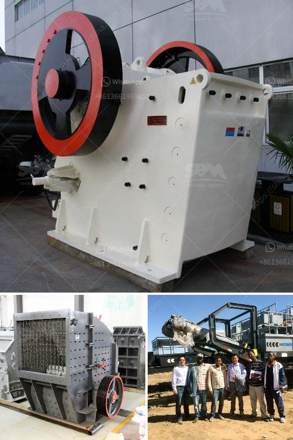

<h3>sand making machine manufacturers</h3>
Sand making machine, also known as vertical shaft impact crusher, is a highly efficient crushing equipment widely used in a variety of rock, abrasives, refractories, cement clinker, quartz, iron ore, concrete aggregate and other hard, brittle materials. It is suitable for crushing and shaping of various metal and non-metallic ores. In recent years, the popularity of sand making machines has been on the rise, leading to a significant increase in the number of sand making machine manufacturers.

Sand making machines are primarily used in construction projects to produce manufactured sand, which is used as a substitute for natural sand. In addition to construction applications, sand making machines are also used in mining, metallurgy, and other industries to process a variety of ores and rocks.

With the increasing demand for sand making machines, numerous manufacturers have emerged in the market. However, not all manufacturers are able to produce high-quality sand making machines. It is crucial for buyers to choose reliable and reputable manufacturers to ensure the quality and performance of the machines.

One of the leading sand making machine manufacturers is XYZ Company. With years of experience in manufacturing mining equipment, XYZ Company has developed its own R&D team and production workshop. The company's sand making machines are known for their high efficiency, low energy consumption, and environmental protection. They are designed to produce excellent particle shape and meet the requirements of various industries.

Another prominent manufacturer is ABC Company. ABC Company specializes in producing sand making machines for the construction industry. Their machines are known for their stable performance, high efficiency, and low maintenance cost. The company has a strong technical team and advanced production equipment, ensuring the quality and durability of their machines.

In addition to XYZ Company and ABC Company, there are many other sand making machine manufacturers in the market. It is important for buyers to consider several factors when choosing a manufacturer. Firstly, the quality and performance of the machines should be the top priority. Buyers should look for manufacturers with a proven track record and positive customer reviews.

Secondly, price is another important factor to consider. Buyers should compare prices from different manufacturers to ensure they are getting the best value for their money. However, it is important to note that the cheapest option may not always be the best in terms of quality and performance.

Lastly, after-sales service is also a crucial factor to consider. Buyers should choose manufacturers that offer a comprehensive after-sales service, including technical support, spare parts availability, and warranty.

In conclusion, sand making machine manufacturers have increased in number due to the growing demand for sand making machines. It is essential for buyers to choose reliable and reputable manufacturers to ensure the quality and performance of the machines. Factors such as quality, price, and after-sales service should be considered when making a purchasing decision.
<h3>Contact us</h3><ul><li><strong>Whatsapp:&nbsp;<a href="https://wa.me/8613661969651">+8613661969651</a></strong></li><li><a href="https://swt.shibang-china.com/?git&amp;zhl&amp;sand making machine manufacturers"><strong>Online Service(chat now)</strong></a></li></ul><h3>Related</h3><ul><li><a href='second hand mobile crusher plant.md'>second hand mobile crusher plant</a></li><li><a href='quarry impact crusher equipment.md'>quarry impact crusher equipment</a></li><li><a href='quarry plant for sale.md'>quarry plant for sale</a></li><li><a href='river stone crushing machine.md'>river stone crushing machine</a></li><li><a href='cone crushers for sale.md'>cone crushers for sale</a></li></ul>