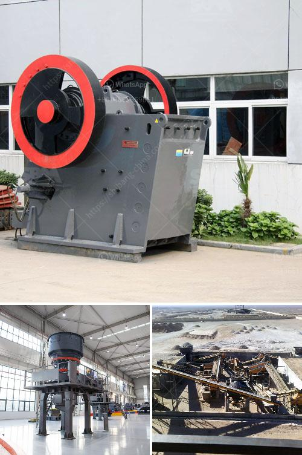

<h3>sand making machine south africa price</h3>
Sand making machine is the specialized equipment used in the manufacturing of construction sand and stone. This machinery is widely used in the sand making plant, metallurgy, chemical, construction material, highway, railway, water conservancy, concrete mixing station and other industries. The sand maker is the key equipment in sand production line, and it is the main factor that determines the quality of sand.

South Africa has abundant mineral resources, especially in recent years with the infrastructure construction ongoing, mining industry become the focus of investment. We all know that the price of sand making machine is important in the process, but the quality of sand making machine is also important. South Africa’s infrastructure construction becomes more and more urgent with the rapid development of economy, so sand making machine is one of the most popular mining machines, welcomed by domestic and foreign customers.

The price of sand making machine is a vital factor that clients will concern. Usually, clients have a certain budget for their sand making machine project. So, what factors will affect the price of sand making machine? Firstly, raw materials. If the raw materials for sand making machine are easy to obtain, the cost will be relatively lower, and the price will be more competitive. Secondly, the manufacturing technology. The more advanced the manufacturing technology, the higher the price of sand making machine. Thirdly, the market demand. If the demand for sand making machine is high, the price will be higher.

In conclusion, the price of sand making machine is influenced by various factors, but the most important factor is the quality of sand making machine. As a professional manufacturer of mining machinery, SBM can provide customers with high-quality equipment and excellent service. Additionally, SBM provides customers with customized solutions to help customers achieve their goals and maximize their benefits. With the strong support of its technical team, SBM is able to design and manufacture various types of sand making machines to meet the diverse needs of customers.
<h3>Contact us</h3><ul><li><strong>Whatsapp:&nbsp;<a href="https://wa.me/8613661969651">+8613661969651</a></strong></li><li><a href="https://swt.shibang-china.com/?git&amp;zhl&amp;sand making machine south africa price"><strong>Online Service(chat now)</strong></a></li></ul><h3>Related</h3><ul><li><a href='rock crushers in south africa.md'>rock crushers in south africa</a></li><li><a href='cone crusher design guideline pdf.md'>cone crusher design guideline pdf</a></li><li><a href='small capacity double roller crusher for sale.md'>small capacity double roller crusher for sale</a></li><li><a href='roller crusher seller.md'>roller crusher seller</a></li><li><a href='ore beneficiation equipment suppliers china.md'>ore beneficiation equipment suppliers china</a></li></ul>