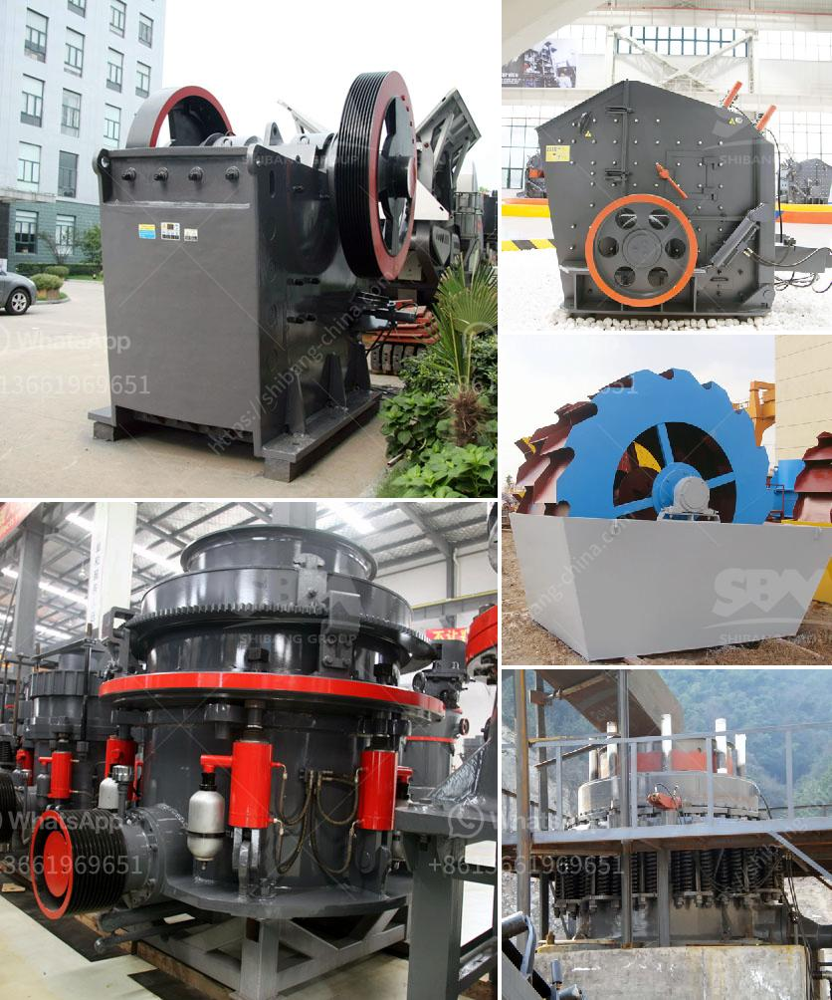

<h3>sand screens and sieves dealers contacts</h3>
Sand screens and sieves are vital tools in various industries, including construction, mining, and agriculture. They are used to separate solid particles from liquids or larger particles from smaller ones. These screens and sieves are easily available in the market through different dealers. In this article, we will explore some key dealers who offer a wide range of sand screens and sieves and provide their contact information.

One prominent dealer in this field is XYZ Industries, located at 123 Market Street. They have gained a reputation for providing high-quality sand screens and sieves to a diverse clientele. XYZ Industries offers an extensive range of products, ensuring that customers can find the perfect solution for their specific needs. They offer both standard and custom-made screens and sieves, allowing for flexibility and customization.

Another reliable dealer is ABC Equipment Co., situated at 456 Main Avenue. This company focuses on delivering durable and efficient sand screens and sieves to its customers. ABC Equipment Co. has built strong partnerships with leading manufacturers to ensure the availability of top-notch products. Their team of knowledgeable professionals is always ready to assist customers in selecting the most suitable screens and sieves for their unique requirements.

DEF Supplies is another reputable dealer known for its wide selection of sand screens and sieves. Situated at 789 Elm Street, DEF Supplies prides itself on offering products that provide high performance and durability. Their range includes various screen sizes and types, catering to different applications. The company understands the importance of customer satisfaction and strives to deliver prompt service and reliable products.

For those looking for a dealer that focuses on affordability without compromising on quality, GHI Merchants is an excellent choice. Located at 101 Oak Street, GHI Merchants offers a range of sand screens and sieves at competitive prices. They believe that every customer should have access to quality products at affordable rates. GHI Merchants has developed a strong network with manufacturers, enabling them to offer their customers cost-effective options.

JKL Tools, situated at 222 Pine Avenue, is known for its commitment to providing technologically advanced sand screens and sieves. They offer innovative solutions to meet the evolving needs of their clients. JKL Tools collaborates with renowned manufacturers globally and ensures that their products adhere to strict quality standards. Their team of experts is always available to assist customers in making informed decisions regarding the selection of screens and sieves.

In conclusion, the demand for sand screens and sieves is prevalent in multiple industries, and several dealers provide access to a wide range of products. XYZ Industries, ABC Equipment Co., DEF Supplies, GHI Merchants, and JKL Tools are among the notable dealers in this field. For further information or to make a purchase, customers can contact these dealers at:

By contacting these dealers, customers can find the perfect sand screens and sieves to meet their specific requirements.
<h3>Contact us</h3><ul><li><strong>Whatsapp:&nbsp;<a href="https://wa.me/8613661969651">+8613661969651</a></strong></li><li><a href="https://swt.shibang-china.com/?git&amp;zhl&amp;sand screens and sieves dealers contacts"><strong>Online Service(chat now)</strong></a></li></ul><h3>Related</h3><ul><li><a href='calcium carbonate crusher.md'>calcium carbonate crusher</a></li><li><a href='crushing machines for sale.md'>crushing machines for sale</a></li><li><a href='coal hammer mill capacity power.md'>coal hammer mill capacity power</a></li><li><a href='how much in bauxite crushing plant.md'>how much in bauxite crushing plant</a></li><li><a href='low cost jaw crusher price.md'>low cost jaw crusher price</a></li></ul>