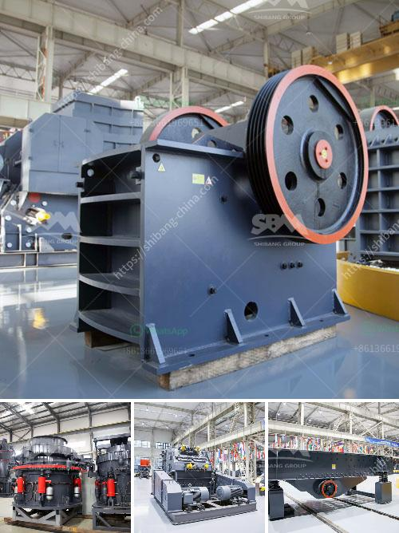

<h3>sand sieving machine by vibrating system chennai</h3>
Sand is an essential construction material and it is used all over the world in various industries. For example, the construction industry relies heavily on sand for the production of concrete. Sand sieving machines are used to separate the sandy particles from the raw material used as a construction material.

In recent years, there has been a significant increase in demand for construction materials, which has led to the need for more efficient sand sieving machines. This is where the vibrating system comes into play. A vibrating system is used to separate the sandy particles from the raw material by using vibrations.

Chennai, being one of the major cities in India, strongly holds onto its traditions and culture. The construction industry in Chennai has witnessed tremendous growth over the years, resulting in an increased demand for construction materials. To meet this demand, sand sieving machines are being used more frequently nowadays. The vibrating system is employed to handle the task of separating the sandy particles from the raw material efficiently.

The sand sieving machine by vibrating system Chennai utilizes vibration technology to separate sand from the raw material it comes in contact with. This machine is meant to separate particles that are larger than the specified size limit of the raw material. It allows the sand to pass through a series of sieves of varying mesh sizes, which separates the particles based on their size. This not only ensures uniformity in the construction material but also reduces the chances of any large particles interfering with the final product.

The vibrating system in the sand sieving machine helps to speed up the process of separating sand from the raw material. The machine uses a vibrating motor that is attached to the sieve. Motor power is used to vibrate the sieve, forcing the sand to move in a specific direction and ultimately separating it from the raw material. The vibrations also help to remove any excess moisture or dirt from the sand, making it clean and ready for use in construction.

One of the major advantages of using a sand sieving machine with a vibrating system in Chennai is that it increases productivity. The machine can handle a larger volume of sand in a shorter period of time compared to manual labor, thereby reducing construction time and costs. Additionally, the machine is designed to be user-friendly, with easy controls and minimal maintenance requirements.

In conclusion, the sand sieving machine by vibrating system Chennai is an essential tool in the construction industry. It helps to separate sandy particles from the raw material efficiently and effectively. With the increasing demand for construction materials in Chennai, the vibrating system in sand sieving machines is becoming more prevalent. It offers numerous benefits such as increased productivity, reduced construction time, and improved quality of the construction material.
<h3>Contact us</h3><ul><li><strong>Whatsapp:&nbsp;<a href="https://wa.me/8613661969651">+8613661969651</a></strong></li><li><a href="https://swt.shibang-china.com/?git&amp;zhl&amp;sand sieving machine by vibrating system chennai"><strong>Online Service(chat now)</strong></a></li></ul><h3>Related</h3><ul><li><a href='iron crushing machine for sale.md'>iron crushing machine for sale</a></li><li><a href='business plan for small scale gold processing plant.md'>business plan for small scale gold processing plant</a></li><li><a href='silica quartz grinding mill 400 mash.md'>silica quartz grinding mill 400 mash</a></li><li><a href='mini cement plant in west bengal.md'>mini cement plant in west bengal</a></li><li><a href='rock crusher for sale philippines.md'>rock crusher for sale philippines</a></li></ul>