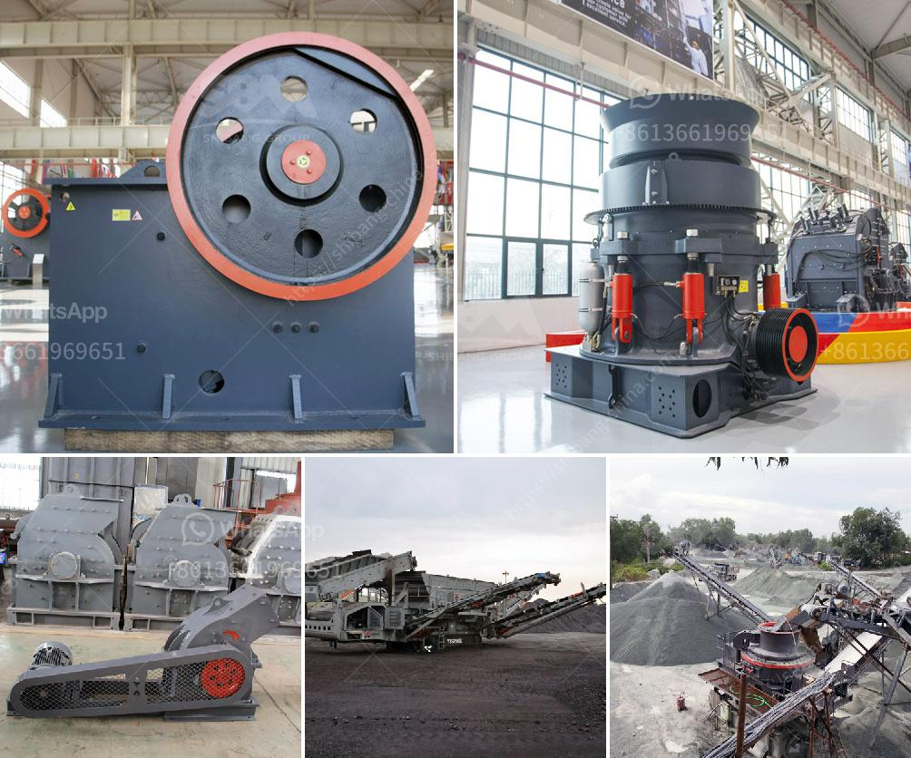

<h3>sand wash plant for sale in india</h3>
Sand is a crucial resource for various construction and infrastructure projects. With India being one of the fastest-growing economies in the world, the demand for sand is constantly increasing to meet the needs of the booming construction industry. However, the indiscriminate extraction of sand from riverbeds and beaches has led to environmental degradation and depletion of this vital resource. To address these issues, sand wash plants have emerged as a sustainable solution. 

A sand wash plant is a facility that separates sand particles from impurities such as clay, silt, and dirt. It employs various techniques such as washing, screening, and dewatering to produce clean, high-quality sand that is suitable for use in construction and other industries. These plants are designed to efficiently remove impurities, ensure uniformity in grain size, and minimize wastage, thereby preserving natural resources and protecting the environment.

India is home to numerous rivers and coastal regions, which are the primary sources of sand. However, the extraction of sand directly from these sources has resulted in serious ecological consequences, including erosion, pollution, and a decline in aquatic biodiversity. Moreover, the absence of proper regulation and monitoring has facilitated illegal sand mining, exacerbating the problems.

The introduction of sand wash plants in India has transformed the sand mining landscape. These plants play a crucial role in ensuring sustainable sand extraction by removing impurities and reducing the environmental impact of mining operations. They are equipped with state-of-the-art technologies and equipment that enhance efficiency and reduce the reliance on manual labor.

One of the key advantages of sand wash plants is their ability to produce high-quality sand with consistent grain sizes. This is critical for construction projects, as uniform sand particles improve the strength and durability of concrete and other building materials. The plants also facilitate the recycling and reuse of water, reducing the consumption of fresh water resources.

In recent years, the demand for sand wash plants in India has been growing exponentially. This has led to the establishment of several manufacturers and suppliers who offer a wide range of plants tailored to different requirements and budgets. The availability of sand wash plants for sale in India has made it easier for construction companies, contractors, and individuals to access these technologies and adopt sustainable practices.

The cost of sand wash plants in India varies depending on factors such as capacity, technology, and features. However, these plants are a long-term investment that offers significant returns in terms of productivity, environmental compliance, and resource conservation. Additionally, some manufacturers also provide after-sales support and maintenance services to ensure optimal performance and longevity of the plants.

In conclusion, sand wash plants have emerged as a sustainable solution to address the issues associated with sand mining in India. Their ability to separate impurities, produce high-quality sand, and minimize wastage makes them indispensable in the construction industry. With the availability of sand wash plants for sale in India, stakeholders can contribute to sustainable development by adopting these technologies and preserving our natural resources for future generations.
<h3>Contact us</h3><ul><li><strong>Whatsapp:&nbsp;<a href="https://wa.me/8613661969651">+8613661969651</a></strong></li><li><a href="https://swt.shibang-china.com/?git&amp;zhl&amp;sand wash plant for sale in india"><strong>Online Service(chat now)</strong></a></li></ul><h3>Related</h3><ul><li><a href='how to grind stone into fine powder.md'>how to grind stone into fine powder</a></li><li><a href='best crushers for manufactured sand.md'>best crushers for manufactured sand</a></li><li><a href='process of preparation of coal and asha.md'>process of preparation of coal and asha</a></li><li><a href='beast crusher price.md'>beast crusher price</a></li><li><a href='the biggest crusher manufacturer in china.md'>the biggest crusher manufacturer in china</a></li></ul>