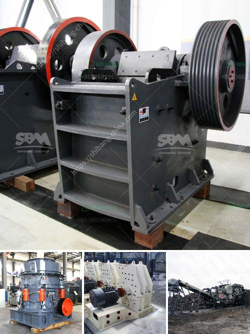

<h3>sand washer machine manual</h3>
A sand washer machine is an essential piece of equipment used to wash and separate sand particles from gravel and other material. It is widely used in the mining, construction, and sand and gravel industries to effectively clean and wash materials.

To ensure the proper use of a sand washer machine, it is important to have a thorough understanding of its operation and maintenance. This article will provide a comprehensive guide on using a sand washer machine and its manual.

Firstly, it is essential to familiarize oneself with the various components of a sand washer machine. This will enable users to understand how each part contributes to the overall functioning of the machine. The main parts of a sand washer machine typically include a motor, a sand washing tank, a spiral impeller, a water supply pipe, a discharge port, and a control panel.

Before operating the machine, it is crucial to check the condition and connection of the various parts. Inspect the motor for any loose connections or irregularities. Ensure that the water supply pipe is securely connected, as any leakage can disrupt the washing process. Additionally, make sure the discharge port is clear from any obstructions to prevent clogging during operation.

Once the machine is ready for use, it is advisable to pre-wet the material before feeding it into the sand washer. This will help to loosen any clumps and facilitate better washing. Simply spray water onto the material using a hose or sprinkler to ensure it is moist and easier to process.

Next, fill the sand washing tank with water. The amount of water required typically depends on the material being processed and the desired level of cleaning. It is recommended to fill the tank up to about two-thirds of its capacity. Adjust the water flow rate using the control panel to achieve the desired level.

When the machine is ready for operation, start the motor to enable the spiral impeller to rotate. The spiral impeller is responsible for stirring and washing the material inside the tank. The rotation should be gentle yet effective at removing dirt, sand, and other unwanted particles.

Monitor the washing process and adjust the speed of the spiral impeller if necessary. Some machines provide multiple speed options to cater to different material types and their cleaning requirements.

After the washing process is complete, use the control panel to halt the motor and stop the rotation of the spiral impeller. Allow the remaining water to drain from the discharge port. Carefully remove the washed material from the machine.

To maintain the longevity and efficiency of the sand washer machine, regular maintenance is crucial. Routinely inspect the machine for any signs of wear and tear or damage. Clean the machine after each use to remove any residual material or debris. Lubricate the moving parts, if applicable, to ensure smooth operation.

In conclusion, a sand washer machine is a valuable asset that aids in the cleaning and washing of sand and gravel materials. By understanding the machine's components and following its manual, users can maximize its efficiency and prolong its lifespan.
<h3>Contact us</h3><ul><li><strong>Whatsapp:&nbsp;<a href="https://wa.me/8613661969651">+8613661969651</a></strong></li><li><a href="https://swt.shibang-china.com/?git&amp;zhl&amp;sand washer machine manual"><strong>Online Service(chat now)</strong></a></li></ul><h3>Related</h3><ul><li><a href='crusher machines for sale.md'>crusher machines for sale</a></li><li><a href='river stone crushing machine.md'>river stone crushing machine</a></li><li><a href='gypsum making machine.md'>gypsum making machine</a></li><li><a href='vertical roller mill manufacture in tamilnadu.md'>vertical roller mill manufacture in tamilnadu</a></li><li><a href='gold hammer mill suppliers in dubai.md'>gold hammer mill suppliers in dubai</a></li></ul>