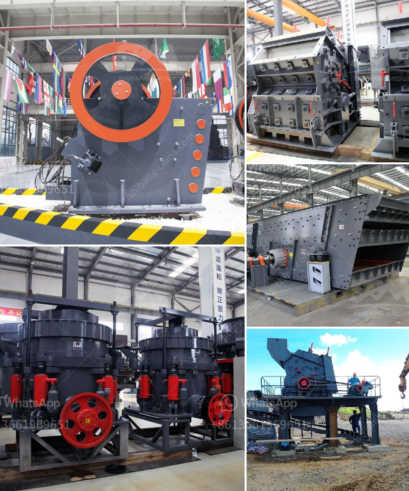

<h3>sand washing machinery</h3>
Sand washing machinery is an essential equipment in the sand making and washing industry. With the growth of construction projects and the increasing demand for sand, the importance of sand washing machines is becoming more significant.

Sand washing machinery is used to clean and separate the dust and impurities from the sand to improve the quality of the sand. The main components of sand washing machines are turbines, impellers, sedimentation tanks, screw washers, and water supply systems. The machine works by passing the sand through the washing machine's drum, where it is agitated and scrubbed to remove the dirt and impurities. The clean sand is then discharged by the rotating turbine, while the wastewater and sediment are collected in the sedimentation tank for later disposal or reuse.

One of the major advantages of sand washing machinery is its ability to remove impurities and achieve a higher level of cleanliness. The machine can effectively remove dirt, dust, and other impurities from the sand, ensuring that the sand used in construction projects meets the required standards. Clean sand is essential for producing high-quality concrete and mortar, as the presence of impurities can compromise the strength and durability of the materials.

Another advantage of sand washing machinery is its versatility and efficiency. The machine can process a wide range of materials, including natural sand, crushed stone, and gravel. It can also handle various sizes of sand particles, from fine sand to coarse sand. This versatility makes it suitable for different applications, such as road construction, building construction, and concrete production. Additionally, sand washing machinery operates efficiently, allowing for large quantities of sand to be processed in a short amount of time, reducing labor and production costs.

In addition to its cleaning and separating capabilities, some advanced sand washing machines also come with special features to further enhance their performance. For example, some machines have adjustable water jets to control the water pressure and intensity during the cleaning process. This allows for a more thorough cleaning and removal of stubborn stains and impurities. Other machines may have a dewatering screen that removes excess water from the sand, making it drier and easier to handle.

In conclusion, sand washing machinery is a crucial equipment in the sand making and washing industry. Its ability to clean and separate dirt and impurities from the sand ensures the production of high-quality materials for construction projects. The versatility and efficiency of sand washing machines make them a valuable asset to companies involved in the production of concrete, mortar, and other building materials. With the increasing demand for sand, the importance of sand washing machinery will continue to grow, providing a reliable and efficient solution for cleaning and processing sand.
<h3>Contact us</h3><ul><li><strong>Whatsapp:&nbsp;<a href="https://wa.me/8613661969651">+8613661969651</a></strong></li><li><a href="https://swt.shibang-china.com/?git&amp;zhl&amp;sand washing machinery"><strong>Online Service(chat now)</strong></a></li></ul><h3>Related</h3><ul><li><a href='used stone crushers for ballast sale.md'>used stone crushers for ballast sale</a></li><li><a href='ball mill to crusher carbon charcoal.md'>ball mill to crusher carbon charcoal</a></li><li><a href='donesia lowongan kerja kuwait cement plant.md'>donesia lowongan kerja kuwait cement plant</a></li><li><a href='slag crusher plant supplier india.md'>slag crusher plant supplier india</a></li><li><a href='portable gold rock crushing machine.md'>portable gold rock crushing machine</a></li></ul>