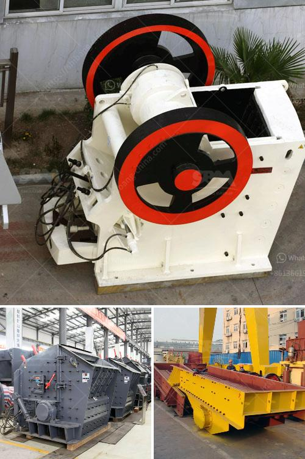

<h3>sand washing plant cost in india</h3>
Sand washing plant cost in India is reasonable for large and small scale stone and sand washing operations. There are three different types of sand washing machines for different sizes of sand production capacity: small scale sand washing plant, medium scale sand washing plant, and large scale sand washing plant. The most popular are the medium scale sand washing plants.

Medium scale sand washing plants typically involve a certain number of machines, such as vibrating feeder, jaw crusher, cone crusher or sand washing machine. The built-in modular design makes installation and reconstruction easier. When the sand washer is operating, the motor propels the impeller to rotate slowly after decelerating through the V-belt, reducer, and gear. The sand materials are fed into the wash tank by the feeding trough, then roll under the drive of the impeller and grind each other to remove impurities. The impurities are flushed out of the wash tank with water and discharged from the overflow outlet.

The sand washing plant cost in India is high due to intense market competition in the industry, but it is still very profitable and worth considering for investors. Based on the demand for hydropower construction sand and gravel, the grading, fineness modulus, and impurity content of the processed sand meet the standard. So the manufactured sand can be used for the production of building materials directly. The sand washing plant can quickly improve the quality of the sand and gravel materials, reduce pollution, and recover resources.

The sand washing machine in India features high production rate, which consumes less power, and even discharges the mud water and impurities in sand and water. The sand washing plant is widely used in sand mining, building materials, transportation, chemical industry, water conservancy and hydropower, concrete mixing stations, etc. The sand washing plant can remove the impurities covering the surface of sand and gravel, and at the same time destroy the water vapor layer covering the sand particles, so as to facilitate the dehydration, and play an efficient sand washing and cleaning effect. The use of sand washing equipment in India is very valuable, for the sand and gravel industry is a mature industry in India. Due to restrictions on mining, natural sand and gravel is scarce nowadays, so the production of artificial sand is an urgent matter for India. With the development of building materials, the demand for directly processed sand has increased, and the sand washing plant can effectively remove impurities from the finished sand products and ensure the quality requirements of artificial sand.

Overall, it is necessary to invest in a sand washing plant to meet the requirements of the construction industry. Sand washing plant is oriented to the needs of the market and focuses on efficiency and quality. In addition, the sand washing plant should be environmentally friendly, and the investment cost should be reasonable. Only in this way can you achieve greater benefits and avoid unnecessary losses while ensuring the sustainable development of the construction industry.
<h3>Contact us</h3><ul><li><strong>Whatsapp:&nbsp;<a href="https://wa.me/8613661969651">+8613661969651</a></strong></li><li><a href="https://swt.shibang-china.com/?git&amp;zhl&amp;sand washing plant cost in india"><strong>Online Service(chat now)</strong></a></li></ul><h3>Related</h3><ul><li><a href='stone crusher machine price kenya.md'>stone crusher machine price kenya</a></li><li><a href='quarry equipment for sale brisbane.md'>quarry equipment for sale brisbane</a></li><li><a href='singapore mining conveyor belt supplier.md'>singapore mining conveyor belt supplier</a></li><li><a href='copper oxide concentrate processing machines.md'>copper oxide concentrate processing machines</a></li><li><a href='hammer mill mesin impor china.md'>hammer mill mesin impor china</a></li></ul>