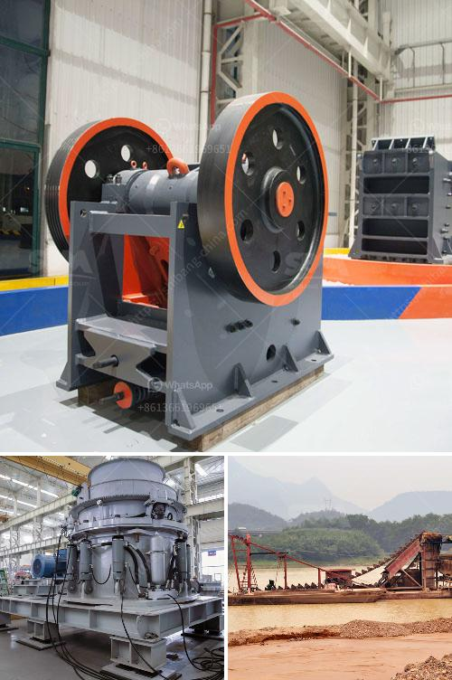

<h3>sayaji stone crusher machine</h3>
Stone crushers are used extensively in mining and various other industrial sectors to crush large rocks and stones into smaller pieces. They are equipped with an intricate system of gears, belt drives, and hydraulic or electric motors to ensure superior performance. One such machine widely used in the construction industry is the Sayaji Stone Crusher Machine. It is designed to reduce large rocks into smaller rocks, gravel, or rock dust for further processing.

Sayaji Stone Crusher Machine has several features that differentiate it from others. Crushers make use of certain principles, methods, and mechanisms for crushing rocks and stones. It uses compressive force to break rock material by squeezing or compressing it between two jaw plates, one stationary and the other moving.

One of the standout features of the Sayaji Stone Crusher Machine is its ability to provide maximum productivity at the lowest cost possible. High-speed performance and compact design help reduce overall operational costs and make it easily transportable and highly convenient to use in different construction sites.

Sayaji Stone Crusher Machine finds wide application in multiple sectors such as mining, construction, metallurgy, chemical, and infrastructure development. It is used to crush various minerals and rocks that can be easily built and demolished, including limestone, granite, basalt, river gravel, and other materials.

1. High crushing ratio: The machine is designed with a high crushing ratio to ensure efficient and effective crushing of the material. This ensures that the end product has a higher content of cubic-shaped particles, resulting in improved quality.

2. Low power consumption: The Sayaji Stone Crusher Machine operates with low power consumption and minimal energy usage. It is highly economical and ensures optimum cost-effectiveness.

3. Easy maintenance: The machine is designed for easy maintenance and operation. With its simple structure, spare parts can be easily replaced, reducing downtime and eliminating long hours of maintenance.

4. Safe operation: The machine is equipped with advanced safety features that ensure safe and secure operation. It is designed to minimize accidents and hazards, providing a safe working environment for the operator.

The Sayaji Stone Crusher Machine is designed to operate at a high crushing speed with a large crushing capacity for different construction applications. It also features a low power consumption and low maintenance requirements. Sayaji Stone Crusher Machine is easy to operate and maintain, ensuring smooth and trouble-free operation for enhanced productivity. Its compact design makes it highly portable for easy transportation between job sites. The machine's excellent performance and affordable pricing make it an ideal choice for various construction activities.
<h3>Contact us</h3><ul><li><strong>Whatsapp:&nbsp;<a href="https://wa.me/8613661969651">+8613661969651</a></strong></li><li><a href="https://swt.shibang-china.com/?git&amp;zhl&amp;sayaji stone crusher machine"><strong>Online Service(chat now)</strong></a></li></ul><h3>Related</h3><ul><li><a href='sell old stone crusher.md'>sell old stone crusher</a></li><li><a href='cement cement grinding ball mill.md'>cement cement grinding ball mill</a></li><li><a href='crusher manufacturer in china.md'>crusher manufacturer in china</a></li><li><a href='how much complete cost for iron ore crasher plants setup.md'>how much complete cost for iron ore crasher plants setup</a></li><li><a href='donesia lowongan kerja kuwait cement plant.md'>donesia lowongan kerja kuwait cement plant</a></li></ul>