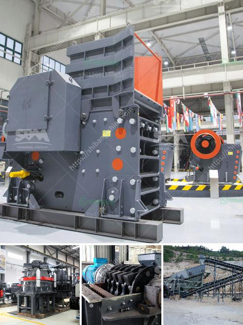

<h3>scale gold mining business plan</h3>
Gold mining is one of the most lucrative businesses in the mining sector. Gold is a symbol of wealth and prosperity, both locally and internationally. Gold mining companies are essential in the gold production chain, both in terms of revenue generation and employment creation. However, starting and running a successful gold mining business requires careful planning and strategic execution. This article provides an overview of the key aspects to consider when developing a scale gold mining business plan.

Before starting a gold mining business, it is crucial to thoroughly analyze the market. Evaluate the demand and supply dynamics, both at the local and global levels. Research on gold prices, international market trends, and potential buyers will help you gain insights into the industry. Understanding the market will also guide you in determining the quantity of gold you can produce and sell profitably.

Choosing the right location for your gold mining operation is of utmost importance. Consider factors such as accessibility, availability of infrastructure, legal and regulatory environment, and proximity to supply chains. Conduct thorough geological surveys to identify areas with high gold potential. Engaging with local communities and understanding their needs and concerns is also vital to ensure smooth operations.

Define the mining methods for your operation. Small-scale gold mining businesses often employ traditional, manual techniques such as panning, sluicing, and hand-digging. These methods are low-cost but time-consuming. Alternatively, mechanized techniques such as open-pit mining, underground mining, or dredging can be used for larger-scale operations. Each method has its own advantages and disadvantages, so choose the one that suits your business size and resources.

Acquiring the necessary mining equipment and machinery is a critical step for a successful gold mining venture. The type of equipment required will depend on the chosen mining method. Equipment can range from basic tools like shovels and pans to sophisticated machinery such as excavators, bulldozers, and gold concentrators. Assess your financial capacity and explore various options, including leasing, purchasing, or partnering with equipment suppliers.

Gold mining, like any other mining activity, can have negative environmental impacts. Develop a comprehensive environmental management plan that includes waste management, land reclamation, water conservation, and biodiversity preservation strategies. Comply with all necessary regulations and engage with relevant environmental agencies to ensure responsible mining practices. Adopting sustainable mining practices early on will protect your business reputation and enhance long-term viability.

Developing a sound financial plan is crucial for the success of your gold mining business. Determine the upfront capital requirement for land acquisition, equipment purchase, permits, licenses, and initial operational costs. Forecast your revenue stream based on projected gold production and prevailing market prices. Account for other variable costs such as labor, maintenance, and transportation. Regularly review and adjust your financial plan to stay aligned with market fluctuations.

Identify and evaluate potential risks associated with your gold mining business. Risks may include geotechnical issues, price volatility, compliance and regulatory risks, labor shortages, and community conflicts. Develop risk mitigation strategies to minimize the impact of these risks on your operation. Seek professional advice and insurance coverage to safeguard your business from unforeseen events.

The gold mining industry provides endless opportunities for entrepreneurs looking to enter the mining sector. However, success in gold mining necessitates careful planning and execution. Understand the market, choose the right location, select appropriate mining methods, acquire necessary assets, address environmental concerns, plan your finances, and assess and mitigate risks. By following these steps and developing a robust business plan, you can pave the way for a profitable and sustainable gold mining venture.
<h3>Contact us</h3><ul><li><strong>Whatsapp:&nbsp;<a href="https://wa.me/8613661969651">+8613661969651</a></strong></li><li><a href="https://swt.shibang-china.com/?git&amp;zhl&amp;scale gold mining business plan"><strong>Online Service(chat now)</strong></a></li></ul><h3>Related</h3><ul><li><a href='crushing plants south africa.md'>crushing plants south africa</a></li><li><a href='15 tph cement grinding unit.md'>15 tph cement grinding unit</a></li><li><a href='limestone mining process.md'>limestone mining process</a></li><li><a href='stone crusher for quarry.md'>stone crusher for quarry</a></li><li><a href='quarry plant all in one gold mining equipment.md'>quarry plant all in one gold mining equipment</a></li></ul>