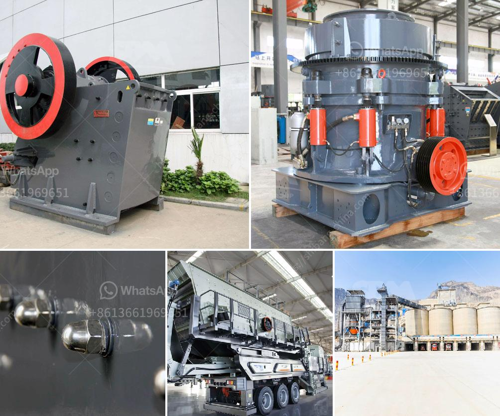

<h3>screening machines specification</h3>
Screening machines are essential equipment used in various industries to separate and remove unwanted particles or materials from the desired product. These machines play a vital role in quality control, ensuring the final product meets the required standards. Understanding the specifications of screening machines is crucial in choosing the right equipment for a specific application.

One important specification to consider is the throughput capacity, which refers to the quantity of material the machine can process within a given time. It is crucial to select a screening machine with a throughput capacity that matches the production requirements. A machine with low capacity may result in production bottlenecks, while a machine with excessive capacity may lead to unnecessary energy consumption.

The size and number of screening decks are also important specifications. The deck is the surface on which the material is separated, and machines can have single or multiple decks. Multiple decks allow for finer separation and higher efficiency. Additionally, the size of the deck determines the screening area, affecting the overall performance of the machine. A larger screening area is suitable for applications requiring high throughput or where fine separation is needed.

Another specification to consider is the type of motion of the screening machine. Vibratory screening machines use a vibrating motion to separate particles based on size, while gyratory screening machines utilize a gyrating motion for separation. The choice between these types depends on the characteristics of the material and desired separation efficiency.

Additionally, the screening machines' construction material is an important specification. Machines can be constructed using stainless steel, mild steel, or a combination of both. The choice of construction material depends on factors such as the type of material being processed and its corrosiveness. Stainless steel is preferred when dealing with corrosive materials or in industries with strict hygiene standards.

In conclusion, understanding the specifications of screening machines is vital in selecting the appropriate equipment for a specific application. Throughput capacity, deck size and number, motion type, and construction material are all critical factors to consider. Making an informed choice not only ensures efficient operation but also guarantees a high-quality final product.
<h3>Contact us</h3><ul><li><strong>Whatsapp:&nbsp;<a href="https://wa.me/8613661969651">+8613661969651</a></strong></li><li><a href="https://swt.shibang-china.com/?git&amp;zhl&amp;screening machines specification"><strong>Online Service(chat now)</strong></a></li></ul><h3>Related</h3><ul><li><a href='stone crushing machine price in india.md'>stone crushing machine price in india</a></li><li><a href='jaw crusher 150 250 para la venta.md'>jaw crusher 150 250 para la venta</a></li><li><a href='carbon black grinding machine.md'>carbon black grinding machine</a></li><li><a href='price of diamond mining construction.md'>price of diamond mining construction</a></li><li><a href='stone crusher plant video.md'>stone crusher plant video</a></li></ul>