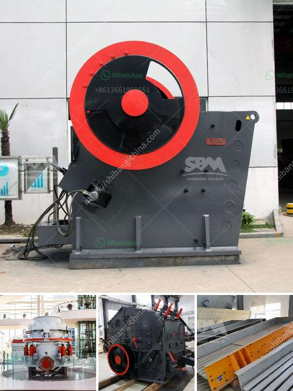

<h3>second hand german jaw crusher for sale</h3>
Second-hand German jaw crushers are now available through various online platforms. Many users describe the machine as versatile and efficient, capable of reducing massive rocks and ores into smaller stones and rubble. These machines utilize a powerful jaw crusher mechanism that reduces the size of various materials to ensure their suitability for construction use.

One of the main advantages of purchasing a second-hand German jaw crusher is its low cost compared to newer models. While the machine may have been used before, its overall condition and functionality are often carefully inspected before being put up for sale. This allows potential buyers to acquire a reliable and robust machine without breaking the bank.

Second-hand German jaw crushers come in various sizes, including smaller models that are ideal for residential construction projects. Larger models, on the other hand, are best suited for industrial applications or major infrastructure developments. With a range of options available, customers can choose the machine that best fits their specific needs and budget.

These crushers are known for their durability and long lifespan. German engineering ensures that the machines are built to withstand heavy-duty use, making them a wise investment for any construction or mining business. Additionally, parts and technical support are usually available, providing customers with peace of mind in case any maintenance or repairs are needed.

When shopping for a second-hand German jaw crusher, it's crucial to do thorough research and compare different listings to find the best deal. Buyers should carefully examine the machine's specifications, maintenance history, and any available warranty. It is also important to consider transportation and installation costs, as some sellers may offer additional services.

In conclusion, second-hand German jaw crushers offer an affordable solution for businesses and individuals seeking reliable crushing equipment. Their versatility, cost-effectiveness, and durability make them a worthwhile investment for a range of applications. Potential buyers should take the time to research and compare different options to ensure they find the best match for their needs.
<h3>Contact us</h3><ul><li><strong>Whatsapp:&nbsp;<a href="https://wa.me/8613661969651">+8613661969651</a></strong></li><li><a href="https://swt.shibang-china.com/?git&amp;zhl&amp;second hand german jaw crusher for sale"><strong>Online Service(chat now)</strong></a></li></ul><h3>Related</h3><ul><li><a href='list of sponge iron factories in hospet.md'>list of sponge iron factories in hospet</a></li><li><a href='coal washing plants for rental in malaysia.md'>coal washing plants for rental in malaysia</a></li><li><a href='river stone crushing plant for sale.md'>river stone crushing plant for sale</a></li><li><a href='ethiopia gypsum machinery supplier.md'>ethiopia gypsum machinery supplier</a></li><li><a href='spare parts for raymond mill.md'>spare parts for raymond mill</a></li></ul>