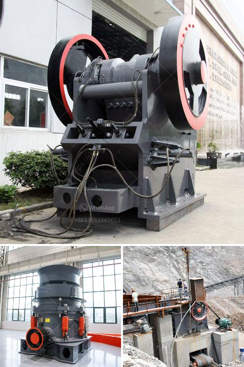

<h3>second hand mobile crusher plant</h3>
Second-hand mobile crusher plant is a recently booming equipment, the price is still relatively expensive, but the price of used mobile crusher has been lower than that of new equipment due to different degrees of wear and tear. What is more, second-hand mobile crusher plant also has distinct advantages in terms of economy, environmental protection, and social benefits. These advantages have prompted more and more users to purchase second-hand mobile crusher plant.

Firstly, compared with new equipment, the price of second-hand mobile crusher plant is relatively low. The used mobile crusher has high quality and stable performance, which will save more budget for customers. Moreover, users can have a more comprehensive understanding of the performance and parameters of the equipment through the on-site operation of the second-hand mobile crusher plant, and can make more rational decisions and choices.

Secondly, in terms of environmental protection, the use of second-hand mobile crusher plant reduces the production of new equipment, which effectively reduces the consumption of resources. By purchasing second-hand mobile crusher plant, customers not only reduce the waste of resources, but also reduce the pollution caused by the production and transportation of new equipment. This is conducive to promoting the sustainable development of society and reducing environmental pressure.

Thirdly, the second-hand mobile crusher plant has good performance and low operating cost. The used mobile crusher plant not only has various crushing and screening functions, but also has flexible configuration and equipment layout. It has strong adaptability, and can be combined with various crushing and screening equipment according to different requirements of customers. At the same time, the second-hand mobile crusher plant has simple structure, compact layout, and convenient maintenance. These characteristics greatly reduce the operating cost and improve the working efficiency of the equipment.

Fourthly, the second-hand mobile crusher plant has a wide range of applications, and can be used for crushing and screening of various ores and construction wastes. It can be widely used in mining, coal mines, garbage and construction waste recycling, earthwork, urban infrastructure, roads or construction sites.

In conclusion, the second-hand mobile crusher plant is a practical and cost-effective equipment. It has the characteristics of small size, lightweight, and flexible configuration. It can meet the individual needs of users, and has the advantages of environmental protection, energy saving, and high efficiency. The second-hand mobile crusher plant is a good choice for users to realize the comprehensive utilization of resources and improve the economic, environmental, and social benefits.
<h3>Contact us</h3><ul><li><strong>Whatsapp:&nbsp;<a href="https://wa.me/8613661969651">+8613661969651</a></strong></li><li><a href="https://swt.shibang-china.com/?git&amp;zhl&amp;second hand mobile crusher plant"><strong>Online Service(chat now)</strong></a></li></ul><h3>Related</h3><ul><li><a href='enquiry stone crusher.md'>enquiry stone crusher</a></li><li><a href='marble grinding mills machine.md'>marble grinding mills machine</a></li><li><a href='how to make barite powder.md'>how to make barite powder</a></li><li><a href='part of hammer mill.md'>part of hammer mill</a></li><li><a href='mobile crushers philippines.md'>mobile crushers philippines</a></li></ul>