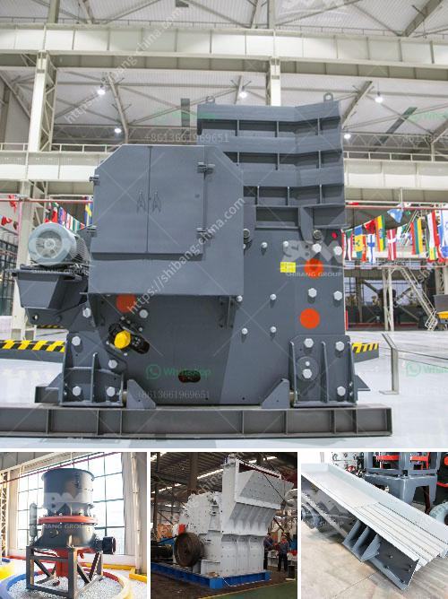

<h3>second hand mobile crushers and screens south africa</h3>
Second-hand mobile crushers and screens are a lucrative option for businesses in South Africa to recycle their construction and demolition waste into valuable materials. These machines can process leftover concrete, rubble, brick, or asphalt into various grain sizes.

The advantages of using mobile crushers and screens from Germany are their excellent mobility and versatility. Such equipment can be transported easily from one site to another, with minimal setup time. This efficiency allows operators to optimize their work schedule and minimize downtime, ultimately making their operations more cost-effective.

One of the main benefits of second-hand mobile crushers and screens is their lower price when compared to new machines. Buying used equipment provides an opportunity for businesses, especially small-to-medium enterprises (SMEs), to invest in machinery that meets their needs without breaking the bank. Additionally, purchasing pre-owned equipment eliminates the lengthy delivery times associated with new machines and allows for immediate use on-site.

Second-hand mobile crushers and screens in South Africa can be ideal for businesses in a variety of industries, such as construction, mining, recycling, demolition, and even entertainment. Those interested in purchasing second-hand mobile crushers and screens in South Africa should also consider the advantages of refurbished equipment.

Refurbished mobile crushers and screens offer the same level of high-performance and customer safety as new machines but at a lower cost. Refurbishing used equipment involves replacing worn parts, addressing any technical issues, and performing a thorough inspection to ensure optimal functionality. By choosing refurbished equipment, businesses can benefit from the peace of mind that comes with a machinery warranty, technical support, and spare parts availability.

It is crucial for businesses in South Africa to explore all available options when it comes to mobile crushers and screens. Investing in pre-owned machinery can have a positive impact on their bottom line, allowing for increased profitability and growth. Moreover, buying second-hand equipment contributes to sustainable practices by reducing waste and environmental impact associated with manufacturing new machines.

When considering second-hand mobile crushers and screens in South Africa, it is important to conduct thorough research on the sellers and their reputation. Choose a reputable seller with a proven track record in the industry, as this ensures transparency and reliability throughout the purchasing process. Inspecting the equipment and understanding its condition and history, as well as taking advantage of any available warranties, will further protect businesses from potential risks.

In conclusion, second-hand mobile crushers and screens offer South African businesses a cost-effective solution for processing construction and demolition waste. Whether choosing new or refurbished equipment, businesses can benefit from the mobility, versatility, and affordability of these machines. By investing in second-hand machinery, they can contribute to sustainability efforts while improving their operational efficiency and profitability.
<h3>Contact us</h3><ul><li><strong>Whatsapp:&nbsp;<a href="https://wa.me/8613661969651">+8613661969651</a></strong></li><li><a href="https://swt.shibang-china.com/?git&amp;zhl&amp;second hand mobile crushers and screens south africa"><strong>Online Service(chat now)</strong></a></li></ul><h3>Related</h3><ul><li><a href='ball mill grinder canada.md'>ball mill grinder canada</a></li><li><a href='ballast processing plant.md'>ballast processing plant</a></li><li><a href='price of stone crush machine in pakistan.md'>price of stone crush machine in pakistan</a></li><li><a href='limestone ball mill machine.md'>limestone ball mill machine</a></li><li><a href='mineral quartz grinding mills in hyderabad.md'>mineral quartz grinding mills in hyderabad</a></li></ul>