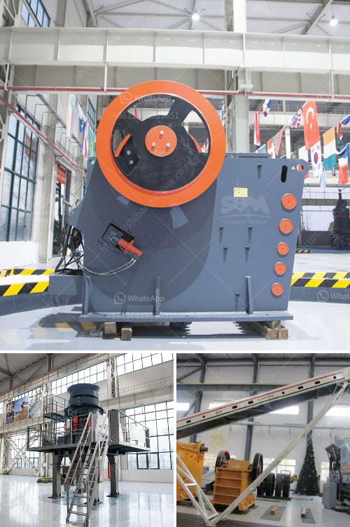

<h3>second hand quarry machinery price in india</h3>
The demand for second-hand quarry machinery is on the rise in India as more and more construction companies are looking to cut costs and increase efficiency. Quarrying is a vital activity that involves the extraction of non-renewable resources such as limestone, granite, and sand. These materials are essential for various construction purposes, including road building, infrastructure development, and housing projects.

Considering the high cost of new machinery, many construction companies, especially small-scale ones, prefer to invest in second-hand quarry machinery. These machines are often well-maintained and offer similar performance to new ones but at a significantly lower price. Additionally, used machinery allows companies to start operations immediately, without the downtime associated with ordering and waiting for delivery of new equipment.

The price of second-hand quarry machinery in India varies depending on several factors. Firstly, the type of machinery and its specific purpose influence its price. For example, a loader used for loading materials onto trucks will generally be priced differently than a crusher used for breaking down large rocks into smaller sizes. Additionally, the condition and age of the machinery also play a significant role in determining the price. Newer and well-maintained machines will obviously come with a higher price tag compared to older and less-maintained ones.

Another factor that affects the price of second-hand quarry machinery is its availability in the market. If there is a high demand for a particular type of machinery, its price may increase due to limited supply. On the other hand, if there are plenty of machines available for sale, the competition among sellers may drive the prices down.

Furthermore, the location of the machinery also impacts its price. In India, the cost of transportation can be substantial, especially if the machinery needs to be transported over long distances. Therefore, the price of machinery located in remote areas would be higher to cover the additional transportation costs.

It is important for buyers to carefully evaluate the condition and performance of second-hand machinery before making a purchase. Inspecting the machine, checking its service history, and testing its performance can help ensure that it meets the buyer's requirements. Additionally, buyers should consider the cost of maintenance and repairs that may be required after the purchase as this will impact the overall cost of ownership.

In conclusion, the demand for second-hand quarry machinery in India is growing as construction companies seek cost-effective solutions for their operations. The price of second-hand machinery varies depending on factors such as the type, condition, availability, and location of the machine. Buyers should conduct thorough inspections and evaluations before purchasing to ensure that the machinery meets their requirements. By investing in second-hand quarry machinery, construction companies can save significantly on costs while maintaining high operational efficiency.
<h3>Contact us</h3><ul><li><strong>Whatsapp:&nbsp;<a href="https://wa.me/8613661969651">+8613661969651</a></strong></li><li><a href="https://swt.shibang-china.com/?git&amp;zhl&amp;second hand quarry machinery price in india"><strong>Online Service(chat now)</strong></a></li></ul><h3>Related</h3><ul><li><a href='gold screening machines south africa.md'>gold screening machines south africa</a></li><li><a href='jaw crusher vs cone crusher.md'>jaw crusher vs cone crusher</a></li><li><a href='mobile sand making machine.md'>mobile sand making machine</a></li><li><a href='jaw rock crusher for sale.md'>jaw rock crusher for sale</a></li><li><a href='aggregate crushing contract in mexico.md'>aggregate crushing contract in mexico</a></li></ul>