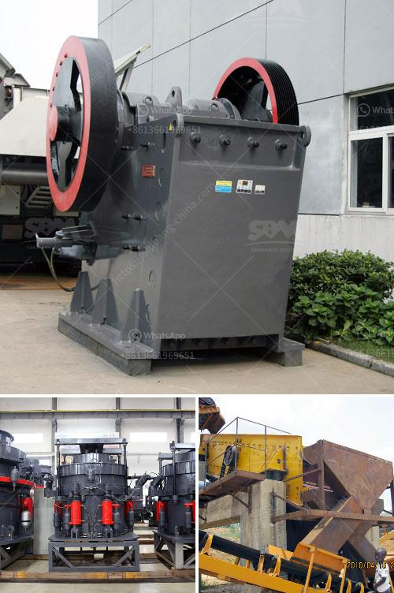

<h3>second hand sand making machine cost</h3>
With the increasing demand for sand in various industries such as construction, road building, and landscaping, the need for efficient and cost-effective sand making machines has become paramount. However, purchasing a brand new sand making machine can be a significant investment for many businesses. This is where second-hand sand making machines come into play.

A second-hand sand making machine refers to the used equipment that has been pre-owned and is available for purchase at a relatively lower cost compared to a brand new machine. The cost of a second-hand sand making machine can range from a fraction of the price of a new machine to slightly lower than its original price, depending on the condition, age, and model of the machine.

One of the main advantages of investing in a second-hand sand making machine is the significant cost savings it offers. By opting for a used machine, businesses can acquire a high-quality sand making equipment without breaking the bank. This cost advantage allows businesses to allocate their budget for other essential aspects of their operations, such as raw materials and labor.

Another advantage of purchasing a second-hand sand making machine is the reduced lead time. Unlike ordering a new machine, which may involve manufacturing and shipping delays, a used machine is readily available for immediate use. This saves precious time for businesses, enabling them to start their sand production process without unnecessary delays.

However, it is essential to consider a few factors before investing in a second-hand sand making machine. Firstly, inspecting the machine thoroughly is crucial to assess its condition, performance, and any potential maintenance or repair requirements. Secondly, inquire about the history of the machine, including its usage, previous ownership, and the reason for its sale. Lastly, it is advisable to consult with a trusted and reputable dealer or seller to ensure a transparent and fair transaction.

In conclusion, a second-hand sand making machine is a cost-effective solution for businesses seeking to produce sand efficiently. With its lower price point and reduced lead time, a used sand making machine allows businesses to optimize their budget and productivity. However, careful evaluation and consideration of the machine's condition and history are essential to ensure a sound investment. By opting for a second-hand sand making machine, businesses can save costs and meet the rising demand for sand in various industries.
<h3>Contact us</h3><ul><li><strong>Whatsapp:&nbsp;<a href="https://wa.me/8613661969651">+8613661969651</a></strong></li><li><a href="https://swt.shibang-china.com/?git&amp;zhl&amp;second hand sand making machine cost"><strong>Online Service(chat now)</strong></a></li></ul><h3>Related</h3><ul><li><a href='small portable rock crushers for sale africa.md'>small portable rock crushers for sale africa</a></li><li><a href='second hand german jaw crusher for sale.md'>second hand german jaw crusher for sale</a></li><li><a href='marble jaw crusher.md'>marble jaw crusher</a></li><li><a href='conveyor belts for sale in zambia.md'>conveyor belts for sale in zambia</a></li><li><a href='vibrating screens pictures.md'>vibrating screens pictures</a></li></ul>