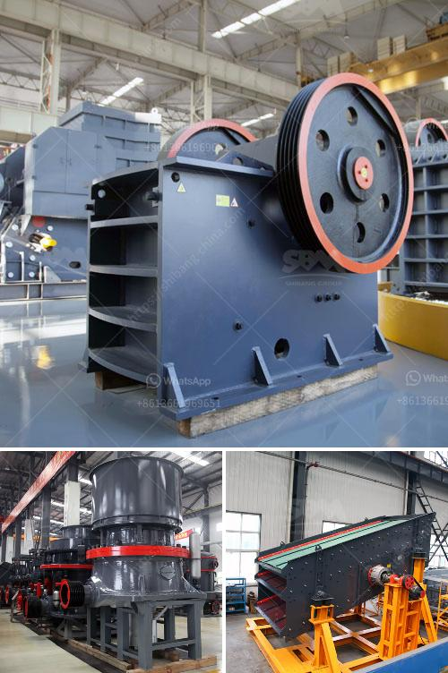

<h3>second stone crusher for sale philippines</h3>
There are many factors affecting the price of the second-hand stone crusher. The rich mineral resources in the Philippines have brought huge opportunities for the country's industrial development. For the second-hand stone crusher, the Philippines is undoubtedly one of the most important markets in the world.

In recent years, the Philippine government has taken action to improve its infrastructure, promote economic development and attract foreign investment. Therefore, the construction industry has been developing rapidly, leading to an increasing demand for construction aggregates such as gravel, crushed stone, and sand. This demand has driven the development of the second-hand stone crusher market.

The second-hand stone crusher is the main equipment in the sand production line and plays a crucial role in the production efficiency of sand production. The Philippines has a rich variety of mineral resources and a large reserves. In particular, the metal ores are abundant and reserves are widely distributed. According to statistics, the reserves of iron ore, gold, copper, and other metal ores are large, and non-metallic minerals such as limestone and marble are also abundant. These mineral resources provide a strong guarantee for the construction industry and the development of the second-hand stone crusher market.

The second-hand stone crusher is also the main equipment in the sand making machine market. The resource utilization of the Philippines has made sand making machines and sand making lines become increasingly popular. The demand of sand and gravel materials in infrastructure projects is increasing day by day. The demand for high-quality aggregates is also increasing. Therefore, the second-hand stone crusher is increasingly sought after by sand and gravel field.

In the Philippines, crusher machines have been sold more and more recently. As a professional supplier of crusher machines, we have a variety of crushers for sale, such as jaw crusher, impact crusher, cone crusher and so on. Our jaw crusher machine can process a wide range of materials, such as granite, marble, basalt, limestone, river pebbles, etc. It is with large crushing ratio, uniform product size, simple structure, reliable performance, easy maintenance, and low operating cost.

In addition, the impact crusher and cone crusher are more popular in the Philippines. They can crush medium and high hardness materials, such as granite, limestone, river pebbles, etc., and are widely used in mining, construction, and road construction.

Overall, the Philippines is the largest market for second-hand stone crushers, making it an important market for the development of the second-hand stone crusher industry. Compared with other Southeast Asian countries, the demand for cone crushers is relatively high in the Philippines, and the price of second-hand stone crushers is relatively low. Therefore, the Philippines is a suitable market for sales.

In conclusion, the second-hand stone crusher market in the Philippines is in full swing. With the rapid development of infrastructure projects, the demand for sand and gravel is also increasing, which promotes the development of B-type machines. In the future, the Philippine construction industry will develop further, and the market for second-hand stone crushers will continue to expand.
<h3>Contact us</h3><ul><li><strong>Whatsapp:&nbsp;<a href="https://wa.me/8613661969651">+8613661969651</a></strong></li><li><a href="https://swt.shibang-china.com/?git&amp;zhl&amp;second stone crusher for sale philippines"><strong>Online Service(chat now)</strong></a></li></ul><h3>Related</h3><ul><li><a href='barite grinding equipment.md'>barite grinding equipment</a></li><li><a href='jaw crusher vs cone crusher.md'>jaw crusher vs cone crusher</a></li><li><a href='production process of gypsum.md'>production process of gypsum</a></li><li><a href='jaw crusher tanzania.md'>jaw crusher tanzania</a></li><li><a href='sand crusher price.md'>sand crusher price</a></li></ul>