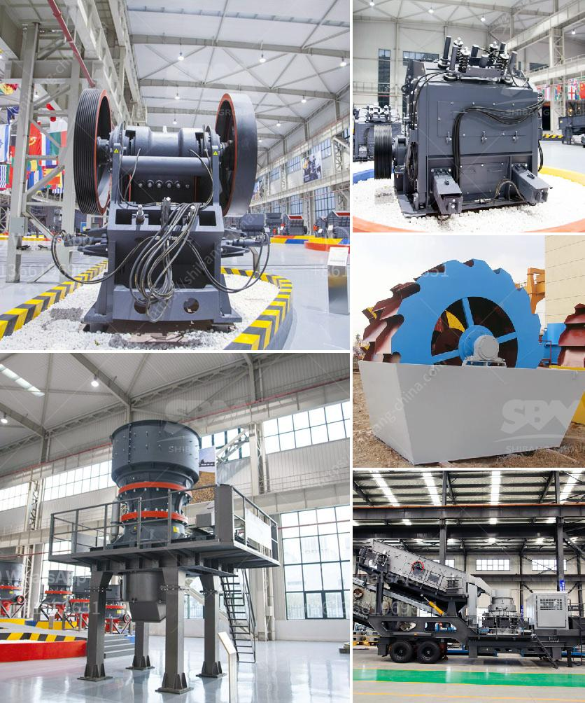

<h3>sell old stone crusher</h3>
Selling old stone crusher machine can be a lucrative business opportunity that involves many challenges and obstacles. However, there are still ways for enterprising individuals to get started and find success.

One of the obstacles to overcome when selling old stone crusher machines is that they are often oversized and difficult to transport. These machines are typically used in the construction industry, where they are required to break down large rocks into smaller pieces that can be used for various purposes. Due to their size and weight, transporting them can be a logistical nightmare.

To overcome this challenge, it is essential to find a reliable and cost-effective transportation method. This can involve renting heavy-duty trucks or partnering with logistics companies that specialize in moving heavy machinery. By investing in the right transportation infrastructure, potential sellers can ensure that they can deliver their products to customers in a timely and efficient manner.

Another challenge when selling old stone crusher machines is finding individuals or businesses who are willing to purchase them. These machines are not commonly bought and sold on traditional platforms like e-commerce websites or classified ads. Instead, sellers need to network within the construction industry and connect with companies that are in need of these machines.

One way to find potential buyers is to attend trade shows and networking events that are specific to the construction industry. These events provide an excellent opportunity to connect with contractors, builders, and other professionals who may be interested in purchasing old stone crusher machines. Additionally, online platforms dedicated to construction equipment marketplaces can also be a valuable resource for sellers.

It is important for sellers to showcase the value of their old stone crusher machines to potential buyers. This can be achieved by highlighting the quality of the machine, its working condition, and any unique features or upgrades it may have. Providing accurate and detailed descriptions, along with clear and high-resolution photographs, will help build trust and credibility with potential buyers.

When setting a price for old stone crusher machines, sellers should consider several factors. The machine's age, condition, brand, and market demand can all influence its value. Conducting thorough market research and comparing prices of similar machines can provide guidance when determining a fair asking price.

Selling old stone crusher machines can be a profitable venture for individuals who are willing to put in the necessary time and effort. By overcoming logistical challenges, networking within the construction industry, and showcasing the value of the machines, sellers can find success in this competitive market.
<h3>Contact us</h3><ul><li><strong>Whatsapp:&nbsp;<a href="https://wa.me/8613661969651">+8613661969651</a></strong></li><li><a href="https://swt.shibang-china.com/?git&amp;zhl&amp;sell old stone crusher"><strong>Online Service(chat now)</strong></a></li></ul><h3>Related</h3><ul><li><a href='cost of crusher run in las vegas.md'>cost of crusher run in las vegas</a></li><li><a href='stone crusher machine price kenya.md'>stone crusher machine price kenya</a></li><li><a href='quarry plant for sale.md'>quarry plant for sale</a></li><li><a href='crusher machine sale.md'>crusher machine sale</a></li><li><a href='mobile crusher tanzania.md'>mobile crusher tanzania</a></li></ul>