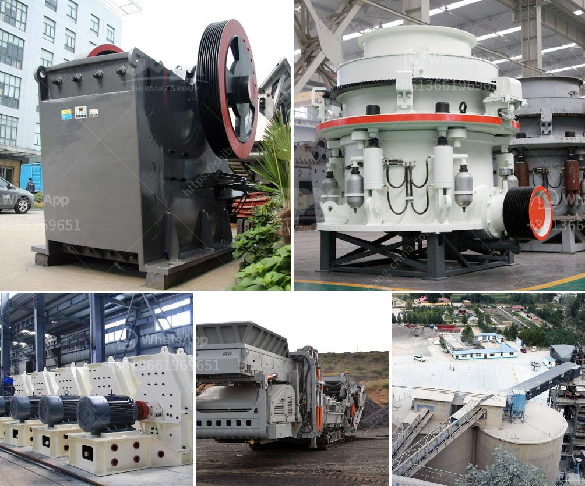

<h3>service planata crusher service</h3>
The increasing global concern for environmental sustainability has forced industries to adopt greener practices while maintaining efficiency. In the construction and demolition industry, the use of appropriate technology is pivotal in achieving these objectives. One such noteworthy solution is the Service Planata Crusher Service, a groundbreaking method that combines efficiency, cost-effectiveness, and eco-friendliness.

The Service Planata Crusher Service offers specialized crushing and recycling services for construction waste and demolition debris. This service utilizes advanced machinery known as the Planata Crusher, which is capable of efficiently reducing large chunks of concrete, bricks, stones, asphalt, and other materials into smaller particles. By processing this waste, construction companies can recover valuable materials for reuse, minimizing the environmental impact and reducing the need for virgin resources.

The Service Planata Crusher Service provides construction companies with a cost-effective alternative to conventional waste disposal methods. Instead of hiring separate waste disposal services, companies can opt for on-site crushing, saving transportation costs and time associated with waste removal. The processed materials can be reused in various construction projects, eliminating the need to purchase additional resources and lowering overall expenses.

Additionally, the Planata Crusher offers exceptional efficiency due to its advanced technology. Its powerful hydraulic system allows it to tackle even the toughest materials with ease. The crusher can crush various types of waste, rapidly reducing waste volumes and facilitating disposal or recycling. This efficiency leads to increased productivity on construction sites, as workers no longer need to waste time sorting and disposing of waste, but can focus on core construction activities.

One of the most notable advantages of the Service Planata Crusher Service is its contribution to environmental sustainability. By reducing the amount of waste sent to landfills, companies can drastically reduce their carbon footprint. The recycling of construction waste also reduces the need for extracting and processing natural resources, minimizing habitat destruction and preserving biodiversity.

Moreover, the recycling process mitigates environmental pollution by preventing the release of harmful materials into the air, water, and soil. Crushing concrete and other waste materials reduces dust and particulate matter, improving air quality in construction sites and surrounding areas. Furthermore, the crushed materials can be used as aggregates in new construction projects, reducing the need for raw materials and thereby conserving natural resources.

The Service Planata Crusher Service is revolutionizing the construction and demolition industry by providing a cost-effective and eco-friendly solution for waste management. By employing this service, companies can efficiently process construction waste, recover valuable materials, and contribute to environmental sustainability. The utilization of the Planata Crusher ensures enhanced efficiency on construction sites, enabling companies to focus on their core operations. As industries strive for greener practices, Service Planata Crusher Service proves to be a viable and practical option for waste management in the construction and demolition sector.
<h3>Contact us</h3><ul><li><strong>Whatsapp:&nbsp;<a href="https://wa.me/8613661969651">+8613661969651</a></strong></li><li><a href="https://swt.shibang-china.com/?git&amp;zhl&amp;service planata crusher service"><strong>Online Service(chat now)</strong></a></li></ul><h3>Related</h3><ul><li><a href='price hammer crusher nigeria.md'>price hammer crusher nigeria</a></li><li><a href='chinese companies looking for partners in africa.md'>chinese companies looking for partners in africa</a></li><li><a href='quarry plant all in one gold mining equipment.md'>quarry plant all in one gold mining equipment</a></li><li><a href='about aggregate crushing comoany in ethiopia.md'>about aggregate crushing comoany in ethiopia</a></li><li><a href='gold screening machines south africa.md'>gold screening machines south africa</a></li></ul>