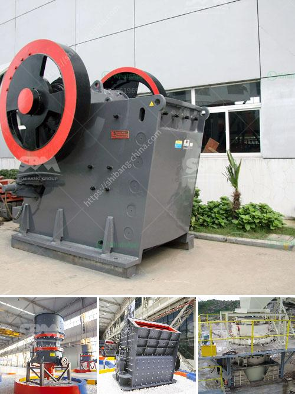

<h3>silica powder making machinery in haiti</h3>
In recent years, Haiti has been striving to improve and diversify its industrial sector as part of its efforts to boost economic growth and reduce dependence on agriculture. One promising area that holds great potential is the manufacturing of silica powder, a key ingredient used in various industries, including construction, glassmaking, and foundry. In this article, we will explore the importance of silica powder making machinery in Haiti and its role in promoting industrial development.

Silica powder, also known as silicon dioxide, is derived from quartz, a widely abundant mineral found in Haiti. The powder is widely used in the construction industry to produce concrete, mortar, and other building materials due to its high strength and durability. Additionally, it is a crucial component in glass manufacturing, providing transparency, heat resistance, and smoothness. Furthermore, silica powder is utilized in foundries as a casting material, contributing to the production of high-quality metal components.

To tap into this lucrative market opportunity, Haiti needs to establish a robust silica powder manufacturing industry. The first step in this process is the acquisition of advanced machinery capable of producing high-grade silica powder efficiently. These machines are designed to crush, grind, and purify quartz, transforming it into a fine powder that meets the demanding requirements of various industrial applications.

By investing in silica powder making machinery, Haiti can create job opportunities and stimulate economic growth. The establishment of manufacturing plants will generate employment for skilled workers, ranging from machine operators and technicians to quality control specialists. These industries will also create a demand for related services, such as transportation, maintenance, and raw material sourcing, contributing to the overall growth of the economy.

Moreover, the production of silica powder within the country will reduce Haiti's reliance on imports, ensuring a steady supply of the mineral at competitive prices. Currently, many industries in Haiti rely on imported silica powder, which leads to increased costs due to transportation and import taxes. By producing silica powder domestically, Haiti can reduce these expenses and offer more affordable products to the local market, consequently encouraging further industrial development.

Additionally, investing in silica powder making machinery can help Haiti position itself as a regional leader in the silica powder manufacturing industry. This would attract foreign investment, technological collaborations, and partnerships with international manufacturers. Not only would this contribute to knowledge transfer and the adoption of best practices, but it would also enhance Haiti's reputation as a competitive manufacturing hub in the Caribbean region.

As with any industrial operation, the establishment of silica powder manufacturing plants must also prioritize environmental sustainability. Implementing proper waste management systems, reducing energy consumption, and minimizing the impact on natural resources are crucial steps to ensure the long-term viability and acceptance of these industries within the Haitian society.

In conclusion, the manufacturing of silica powder holds immense potential for Haiti's economic growth and industrial development. By investing in advanced machinery and establishing manufacturing plants, Haiti can generate employment opportunities, reduce imports, and position itself as a regional leader in the industry. The successful implementation of these initiatives must be accompanied by responsible environmental practices to ensure sustainable growth. With the right investments and strategic planning, Haiti can unlock the benefits of silica powder manufacturing and pave the way for a prosperous industrial future.
<h3>Contact us</h3><ul><li><strong>Whatsapp:&nbsp;<a href="https://wa.me/8613661969651">+8613661969651</a></strong></li><li><a href="https://swt.shibang-china.com/?git&amp;zhl&amp;silica powder making machinery in haiti"><strong>Online Service(chat now)</strong></a></li></ul><h3>Related</h3><ul><li><a href='cost of conveyor belt system for coal loading.md'>cost of conveyor belt system for coal loading</a></li><li><a href='powder grinding mill price.md'>powder grinding mill price</a></li><li><a href='aggregates plant for construction.md'>aggregates plant for construction</a></li><li><a href='mobile mining gold equipment.md'>mobile mining gold equipment</a></li><li><a href='small capacity double roller crusher for sale.md'>small capacity double roller crusher for sale</a></li></ul>