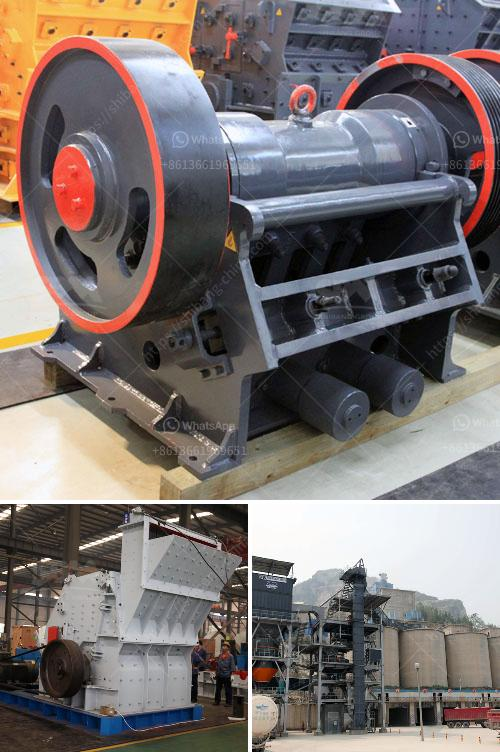

<h3>silica quartz grinding mill 400 mash</h3>
Silica quartz grinding mill is used for grinding fine powder from 400 mesh to 3000 mesh, which enables more than 99% of the mineral particles to achieve the required particle size range, which is also the key to successful mineral processing.

Silica quartz grinding mill is mainly used in mining, building materials, chemical industry, metallurgy, refractory materials, ceramics, cement, power generation and other industries. Its finished products are calcite, barite, potassium feldspar, talc, marble, limestone, dolomite, fluorite, lime, activated clay, activated carbon, bentonite, kaolin, cement, phosphate rock, gypsum, glass, granite, quartz stone, diabase, and more than 200 kinds of materials with Mohs hardness not exceeding 9.3 and humidity below 6%.

In recent years, the demand for silica quartz grinding mill has been increasing rapidly due to its wide range of applications and high grinding efficiency. With the continuous improvement of technology, the grinding mill has made great breakthroughs in energy saving, environmental protection and automation. It not only solves the environmental pollution caused by traditional milling equipment, but also improves the production efficiency and saves a lot of production costs for users.

The 400-mesh silica quartz grinding mill produced by our company can process 200 tons of silica quartz powder per hour, with a wide range of fineness and adjustable fineness. The appearance of silica quartz is milky white, spherical, pure and precious. It has the properties of toughness, heat resistance, high purity, corrosion resistance, wear resistance and electrical insulation. It is an important industrial mineral raw material, widely used in glass, casting, ceramics and refractory materials, smelting ferrosilicon, metallurgical fluxes, silicon metal, precision casting, silicone rubber, pvc sheet, optical fiber, insulating fiber, reducer, metallurgical materials, metallurgical materials, rubber, plastic, paint, new building materials, etc.

To achieve high efficiency, low energy consumption, large processing capacity, environmental protection and other production requirements, it is necessary to choose the right equipment. The silica quartz grinding mill we provided is a new type of energy saving and environmental protection equipment. It has the advantages of high grinding efficiency, low power consumption, large feeding size, low maintenance cost, less wear and tear, long service life, etc. Moreover, it adopts advanced technology, with stable and reliable performance, simple operation and convenient maintenance.

In conclusion, the 400-mesh silica quartz grinding mill produced by our company is applied in various industries and has been well received by customers. It not only meets the needs of the market, but also creates considerable economic benefits for customers. With the continuous development of science and technology, we believe that the future of silica quartz grinding mill will be more promising, and it will make greater contributions to the industrial development and environmental protection.
<h3>Contact us</h3><ul><li><strong>Whatsapp:&nbsp;<a href="https://wa.me/8613661969651">+8613661969651</a></strong></li><li><a href="https://swt.shibang-china.com/?git&amp;zhl&amp;silica quartz grinding mill 400 mash"><strong>Online Service(chat now)</strong></a></li></ul><h3>Related</h3><ul><li><a href='hydraulic cone crusher.md'>hydraulic cone crusher</a></li><li><a href='gold mining processing plant in canada.md'>gold mining processing plant in canada</a></li><li><a href='made in germany stone crusher.md'>made in germany stone crusher</a></li><li><a href='vibration screen machine in pakistan.md'>vibration screen machine in pakistan</a></li><li><a href='manufacturer of portable floatation plant in china.md'>manufacturer of portable floatation plant in china</a></li></ul>