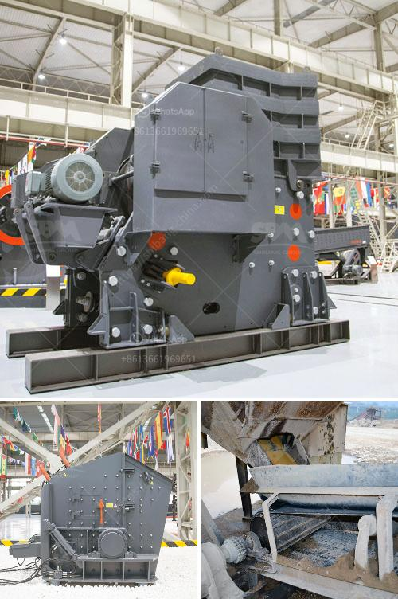

<h3>silica sand ball mill</h3>
Silica sand ball mill is a crucial and efficient grinding equipment for the manufacture of fine powders and granules in industries such as cement, glass, ceramics, silicate, fertilizer, ferrous and non-ferrous metal, chemical, and so on. It is also used for the production of nanoparticles with controlled particle size distribution.

Silica sand finds numerous applications in construction, abrasive blasting, hydraulic fracturing, and water filtration, to name a few. The processing of silica sand requires a high degree of precision and control to ensure its quality and uniformity. This is where the silica sand ball mill comes into play.

The main components of a silica sand ball mill are the cylinder, the lining plate, the material feeding and discharging device, the hollow shaft, and the driving device. These components work together to facilitate the grinding process and achieve high grinding efficiency.

One key advantage of a silica sand ball mill is its ability to maintain a narrow particle size distribution. This is due to the use of a closed-circuit grinding system, which consists of a mill and a separator. The separator classifies the ground materials, ensuring that only fine particles are discharged, while the coarse particles are returned to the mill for further grinding.

Another important feature of a silica sand ball mill is its low energy consumption. The grinding process is facilitated by the rotation of the mill cylinder, which generates centrifugal force to lift and drop the grinding media. This energy-efficient operation helps reduce energy consumption and minimize operating costs.

Silica sand ball mills are also equipped with a variety of different grinding media, such as steel balls, ceramic balls, and pebbles. These grinding media can be adjusted in terms of size and material to suit different milling needs. This flexibility allows for the production of various types of silica sand powders and granules with different properties.

In conclusion, the silica sand ball mill is an indispensable grinding equipment for the manufacture of fine powders and granules. Its precise control of particle size distribution and low energy consumption make it ideal for various industrial applications. With ongoing technological advancements, silica sand ball mills are set to become even more efficient and versatile in the future.
<h3>Contact us</h3><ul><li><strong>Whatsapp:&nbsp;<a href="https://wa.me/8613661969651">+8613661969651</a></strong></li><li><a href="https://swt.shibang-china.com/?git&amp;zhl&amp;silica sand ball mill"><strong>Online Service(chat now)</strong></a></li></ul><h3>Related</h3><ul><li><a href='ore grinding mills china.md'>ore grinding mills china</a></li><li><a href='jaw crusher vs cone crusher.md'>jaw crusher vs cone crusher</a></li><li><a href='jual raymond mill bekas.md'>jual raymond mill bekas</a></li><li><a href='list of equipments needed to start gold mining.md'>list of equipments needed to start gold mining</a></li><li><a href='gold processing mecury sales gauteng.md'>gold processing mecury sales gauteng</a></li></ul>