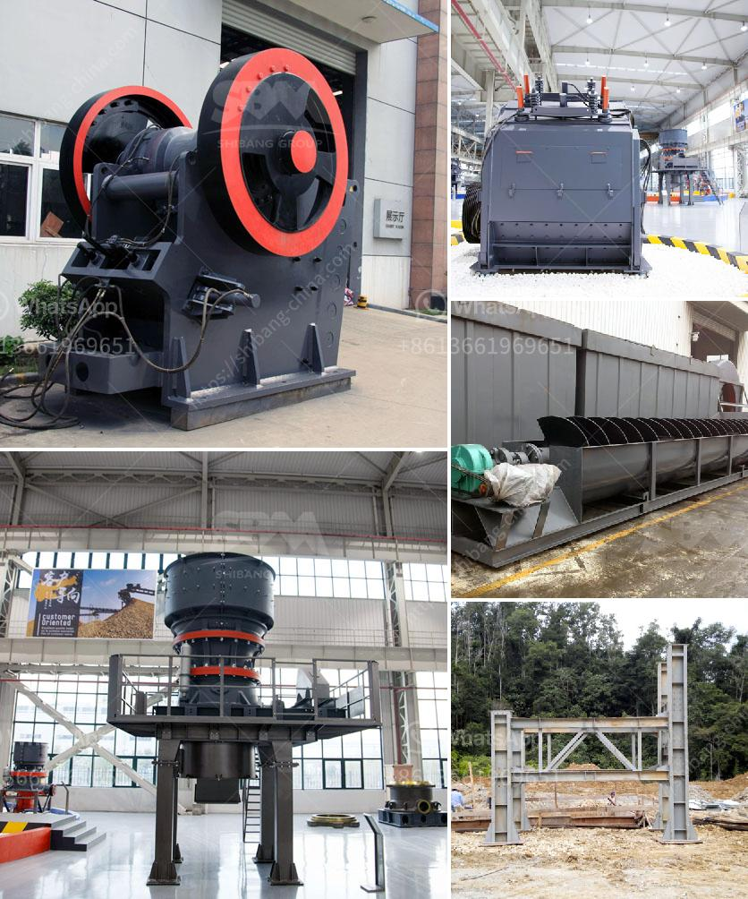

<h3>silica sand crusher in turkey</h3>
Silica sand is one of the most abundant minerals on the planet and its widespread usage across a range of industries makes it a crucial resource. The silica sand crusher plays a vital role in the mining process of silica sand.

Turkey is home to a significant silica sand mining industry. In recent years, there has been an increase in the extraction and production of silica sand in the country. Silica sand crushers are essential for its mining and processing.

Silica sand crusher in Turkey is primarily used at construction sites and foundries for creating concrete and bricks. Some of the materials that can be processed by this machine include quartz, sandstone, and more. The crushing and grinding process will provide a range of particles that will be blended with other materials to create diverse products.

The mining of silica sand in Turkey involves various processes such as mining, crushing, screening, and washing. It is carried out to remove impurities, such as clay, silt, and organic matter, to produce high-quality silica sand that meets the specifications for different applications.

One of the key components of the silica sand crusher in Turkey is the jaw crusher, also known as the primary crusher. This machine is responsible for the coarse crushing of the quarried material. The raw material that is extracted from the quarry is fed into the jaw crusher, where it is crushed into smaller particles.

After primary crushing, the crushed material is then sent to the secondary crusher, such as a cone crusher or impact crusher, for further processing. These machines further reduce the size of the particles and produce finer particles of silica sand.

The final stage in the crushing process is the tertiary crusher. This crusher is responsible for further reducing the size of the particles to a desired level. The crushed material is then screened to separate the desired size fractions from the oversize and undersize particles.

Once the crushing and screening process is complete, the silica sand is washed to remove any remaining impurities. This is done using water and various types of equipment, such as rotary scrubbers and hydrocyclones. The washed silica sand is then stored and transported to different industries for further processing and use.

The silica sand crusher in Turkey plays a crucial role in the mining and processing of silica sand. Its excellent crushing capability and high production efficiency make it suitable for both small and large-scale silica sand mining operations. The machine has been widely used in Turkey, bringing benefits to local economy and community development.

In conclusion, the silica sand crusher in Turkey is an important piece of equipment in the silica sand mining and processing industry. It provides efficient and reliable crushing capabilities, making it indispensable for the extraction and production of high-quality silica sand.
<h3>Contact us</h3><ul><li><strong>Whatsapp:&nbsp;<a href="https://wa.me/8613661969651">+8613661969651</a></strong></li><li><a href="https://swt.shibang-china.com/?git&amp;zhl&amp;silica sand crusher in turkey"><strong>Online Service(chat now)</strong></a></li></ul><h3>Related</h3><ul><li><a href='calcium carbonate crusher.md'>calcium carbonate crusher</a></li><li><a href='quarry machines for sale.md'>quarry machines for sale</a></li><li><a href='used stone crusher machine for sale in uae.md'>used stone crusher machine for sale in uae</a></li><li><a href='used stone crusher for sale in usa.md'>used stone crusher for sale in usa</a></li><li><a href='quartz manufacturing plant.md'>quartz manufacturing plant</a></li></ul>