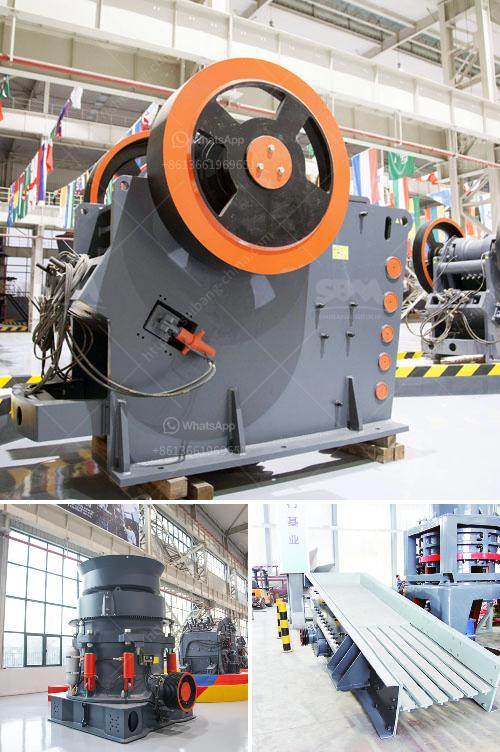

<h3>silica sand grinding machine</h3>
Silica sand is a mineral resource that can be used in a wide variety of industries, including construction, glass making, metallurgy, and more. With its high melting point, elasticity, and durability, it is an essential material in the manufacturing of numerous products.

One of the key uses of silica sand is as a raw material for industrial grinding. Different industries require different particle sizes for the functionality of their products, and silica sand grinding machine plays a crucial role in this process.

The sand can be processed into various grain sizes, including coarse sand, medium sand, and fine sand. Coarse sand and medium sand are used for construction purposes, such as mixing concrete and building foundations. Fine sand, on the other hand, is used in glass production, ceramics, and foundry molds.

Silica sand grinding machine, also known as pulverizer or grinder, is a mechanical device used for grinding materials into fine particles. Grinding process of silica sand, the products can be widely used in various industries as raw materials.

For example, the glass industry uses silica sand such as flat glass, plate glass, automotive glass, and other architectural glass products. Optical fibers and other high-tech products also use silica sand as the core material. Silica sand is also the main raw material for each industry such as construction, chemicals, metallurgical, solar cells, and semiconductors.

Grinding machines are widely used in mining, construction, and other industries. The most common grinding materials are raw ore, including coal, silicon carbide, iron ore, copper ore, gold ore, limestone, calcite, gypsum, dolomite, marble, mica, feldspar, talc, graphite, quartz, and more. These materials are brittle and require high grinding efficiency to ensure their production value.

There are many types of grinding machines available in the market, including ball mills, rod mills, hammer mills, knife mills, and many more. Each of these machines has its own unique characteristics and capabilities. However, when it comes to silica sand grinding, the most popular and widely used machine is the ball mill.

The ball mill is an efficient grinding machine that grinds material into fine particles through the collision of the media and the material's friction with the lining plate. The grinding process of silica sand often adopts a multistage grinding system, usually including primary grinding, secondary grinding, and ultrafine grinding.

The primary grinding process includes the use of a crusher for coarse crushing, and then the crushed material is sent to a ball mill for further grinding. The secondary grinding process involves the use of a ball mill or Raymond mill, which is essential for fine grinding of silica sand.

Once the silica sand grinding process is completed, the silica sand can be used for multiple purposes, such as ceramic casting, glass making, and the production of various other high-value products.

In conclusion, silica sand grinding machines are crucial equipment for silica sand processing. They are widely used in various industries to grind raw materials into fine particles, which enhances the quality and value of final products. With the continuous advancement of technology, the machines are becoming more efficient and versatile, catering to the growing demand for silica sand in numerous industries.
<h3>Contact us</h3><ul><li><strong>Whatsapp:&nbsp;<a href="https://wa.me/8613661969651">+8613661969651</a></strong></li><li><a href="https://swt.shibang-china.com/?git&amp;zhl&amp;silica sand grinding machine"><strong>Online Service(chat now)</strong></a></li></ul><h3>Related</h3><ul><li><a href='part of hammer mill.md'>part of hammer mill</a></li><li><a href='chinese limestone mining investors.md'>chinese limestone mining investors</a></li><li><a href='project on stone crushing unit.md'>project on stone crushing unit</a></li><li><a href='used coal wash plant canada for sale.md'>used coal wash plant canada for sale</a></li><li><a href='sand washing machine zenith.md'>sand washing machine zenith</a></li></ul>