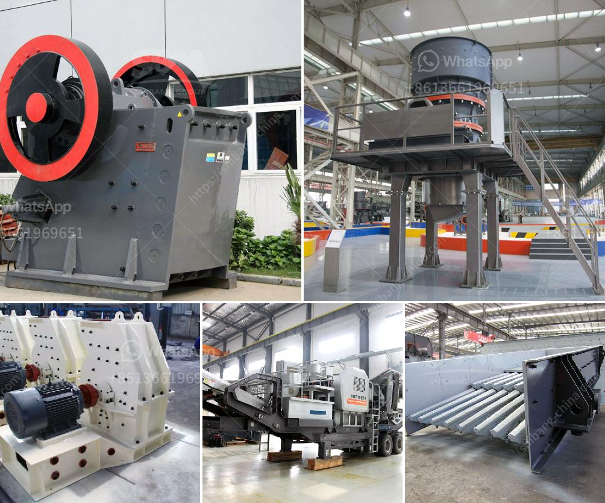

<h3>silica sand mining process equipment in south africa</h3>
Silica sand is one of the most abundant minerals on the Earth's crust, and it is primarily used in industrial processes as a raw material for glass, ceramics, and other manufacturing applications. Silica sand mining operations can vary in size and location, but typically involve the extraction of sand deposits from open pits or by dredging. Silica sand mining operations in South Africa are commonly used to extract high-quality silica sand for use in various applications, including as frac sand for the oil and gas industry.

The process of silica sand mining involves several steps. First, the soil and overburden (the vegetation and large rocks) on top of the sand deposit are cleared, usually using bulldozers. Once the overburden is removed, the sand is excavated using heavy machinery, such as front-end loaders or hydraulic excavators. The sand is then transported to a processing plant, where it is washed, screened, and sorted.

Washing is an important step in the silica sand mining process and involves removing any impurities, such as clay or iron oxides, which could negatively impact the quality and use of the final product. In some instances, the sand may be subjected to a process known as attrition scrubbing, in which the particles are scrubbed to break down the coatings of impurities. This helps to ensure that the final product has a high silica content and is suitable for its intended application.

After washing, the sand is then screened to separate it into different size fractions. Depending on the application, the silica sand may be required to meet specific size specifications. For example, in the glass manufacturing industry, different size fractions of silica sand are used to produce different types of glass products, such as bottles, windows, and optical fibers. The screened sand is then sorted into different stockpiles or loaded directly into trucks or railcars for transportation.

Silica sand mining operations in South Africa are also conducted using hydropower and conventional electricity. Mining methods vary, but most silica sand is produced using open-pit mining methods. Once the sand is extracted, it is transported to the processing plant for washing and screening.

The final product is then shipped by truck or rail to customers in various industries, such as glass manufacturing, foundries, construction, and water filtration. Silica sand mining in South Africa has become one of the key driving forces behind the country's mining sector. With demand for silica sand increasing, mining companies are under pressure to optimize their operations and maximize yield to meet the demands of various industries.

Overall, the silica sand mining process entails washing, screening, and sorting the sand for use in various applications. If successfully carried out, the mining process allows companies to produce high-quality silica sand products that meet the specifications of their customers. As demand for silica sand continues to grow, it is likely that the mining process will become even more efficient and environmentally friendly in the future.
<h3>Contact us</h3><ul><li><strong>Whatsapp:&nbsp;<a href="https://wa.me/8613661969651">+8613661969651</a></strong></li><li><a href="https://swt.shibang-china.com/?git&amp;zhl&amp;silica sand mining process equipment in south africa"><strong>Online Service(chat now)</strong></a></li></ul><h3>Related</h3><ul><li><a href='impact crusher dealer.md'>impact crusher dealer</a></li><li><a href='harga mesin molen di medan.md'>harga mesin molen di medan</a></li><li><a href='price of zenithcrusher plant.md'>price of zenithcrusher plant</a></li><li><a href='dry grinding mill.md'>dry grinding mill</a></li><li><a href='low cost roller mill suppliers india.md'>low cost roller mill suppliers india</a></li></ul>