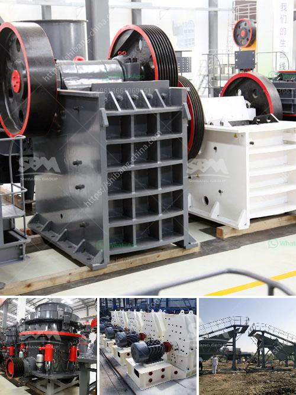

<h3>silica sand processing plant</h3>
Silica sand processing plant is used to separate the valuable minerals from the waste materials. It is a necessary step in the production of high purity silica sand. And there are mainly two types of silica sand washing machines, spiral classifier and wheel sand washer.

Spiral classifier is a traditional type of classification equipment, mainly for metal mineral processing for the slurry density and particle size on the wet grade, mining operations could also be used in the flow desliming. Model: Submerged series and High Weir series. Spiral Diameter: 300-3000mm. Sink Length: 3000-14300mm.

Wheel sand washer is a kind of wheel-type washing equipment and can clean and separate the dust and powder from the sand. Its new seal-structure and reliable driving device can make sure the cleaning effect and a kind of high efficiency sand washing equipment matched with the sand making machine.

The following is the usual purification process of quartz/silica sand. The raw ore is crushed and screened to remove impurities, then washed and scrubbed to further remove the impurities from the silica sand. After these processes, the raw materials will be dried. Then through the vibrating screen, the different specifications of silica sand will be separated. And then washed by spiral classifier or wheel sand washer as needed.

Silica sand washing plant includes vibrating feeder, jaw crusher, VSI crusher (sand making machine), vibrating screen, silica sand washer, belt conveyor and centrally electric controlling system, etc. The designed capacity comes from 40t/h to 1000t/h. Sand washing may be the easiest and cheapest way to complete the washing task through the use of one or more mechanically cleaned filters. Also, the lines are available with multiple stages involving several-blade style basket for enhanced filter surface area.

Silica sand drying plant is a little different from the usual drying plants, as it has a special design on the inner structure. After initial crushing, wet processing may be applied. In this particular process, to make certain that the impurities are removed, it is actually very important to scrub the quartz sand utilizing a chemical compound. The drying out process, thus, becomes more thorough. Hence, it may take over the usual drying plants.

In conclusion, silica sand processing plant is used to separate the minerals from the waste materials. It is a necessary step in the production of high purity silica sand. And there are mainly two types of silica sand washing machines, spiral classifier and wheel sand washer. Silica sand processing plant technical process includes washing, drying and screening.
<h3>Contact us</h3><ul><li><strong>Whatsapp:&nbsp;<a href="https://wa.me/8613661969651">+8613661969651</a></strong></li><li><a href="https://swt.shibang-china.com/?git&amp;zhl&amp;silica sand processing plant"><strong>Online Service(chat now)</strong></a></li></ul><h3>Related</h3><ul><li><a href='jaw crusher of zenith.md'>jaw crusher of zenith</a></li><li><a href='crusher processing plant malaysia.md'>crusher processing plant malaysia</a></li><li><a href='quartz crusher machine.md'>quartz crusher machine</a></li><li><a href='germany stone crusher 30tph.md'>germany stone crusher 30tph</a></li><li><a href='dry processing of coal in south africa.md'>dry processing of coal in south africa</a></li></ul>