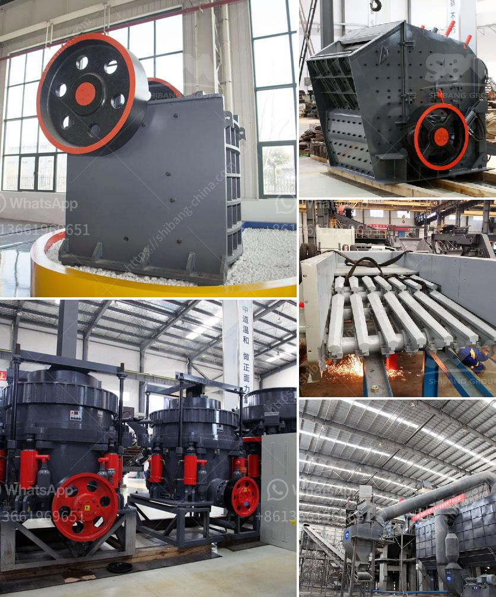

<h3>silica sand production line stone crusher machine</h3>
Silica sand is a hard and durable material that is used in a variety of industries such as construction, glass making, ceramics, and foundry. It is commonly found in quartz form and is composed of silicon dioxide (SiO2). Silica sand production line is the major crushing plant to process high-quality silica sand substitute for river sand, the most widely used raw material is quartzite, or quartz sand.

First of all, the raw materials are evenly sent to the jaw crusher by the vibrating feeder for primary crushing, and then the rough materials are conveyed to the impact crusher by the belt conveyor for further crushing. The vibrating screen is used to separate the crushed particles into different sizes. The qualified particles are sent to the sand making machine for shaping, while the unqualified ones are returned to the impact crusher for further crushing until they meet the requirements.

The silica sand production line is designed in a high flexibility, making it suitable for a wide range of applications, including construction, glass making, ceramics, and foundry. The whole production line adopts advanced technology, which ensures high efficiency and low production cost. The final product has a uniform particle size and excellent shape, which meets the requirements of various industries.

One of the key components of the silica sand production line is the stone crusher machine. It mainly consists of vibrating feeder, jaw crusher, impact crusher, vibrating screen, belt conveyor, and the designed production capacity is 50-800 tph. Among these machines, jaw crusher is the primary crushing equipment, which acts as the first stage of the crushing process. It has been widely used in many industries such as mining, metallurgy, building materials, and chemical engineering.

In the silica sand production line, the stone crusher machine plays a vital role. It is the key equipment for crushing and processing raw materials. It is widely used in the mining and quarrying industry around the world, providing high-quality silica sand for various applications. With the rapid development of technology, the demand for silica sand is increasing, and the stone crusher machine is becoming more and more popular in this field.

Compared with traditional crushers, the stone crusher machine has many advantages. The advanced crushing principle ensures high crushing ratio and large capacity. The deep cavity structure design allows the materials to be evenly crushed and has a good granular shape. The hydraulic system provides overload protection and easy adjustment of the discharge port. The wear-resistant parts are made of high-quality materials, which prolong the service life of the machine.

In conclusion, the silica sand production line stone crusher machine is essential equipment in the silica sand production line. It is used for primary and secondary crushing of raw materials, ensuring the quality and shape of the final product. With the continuous development of technology, the stone crusher machine will have a wider range of applications and bring more benefits to the industry.
<h3>Contact us</h3><ul><li><strong>Whatsapp:&nbsp;<a href="https://wa.me/8613661969651">+8613661969651</a></strong></li><li><a href="https://swt.shibang-china.com/?git&amp;zhl&amp;silica sand production line stone crusher machine"><strong>Online Service(chat now)</strong></a></li></ul><h3>Related</h3><ul><li><a href='jaw crusher for 100x200.md'>jaw crusher for 100x200</a></li><li><a href='mobile crusher in codelco.md'>mobile crusher in codelco</a></li><li><a href='crusher in sale in nepal.md'>crusher in sale in nepal</a></li><li><a href='crusher hammer material grade.md'>crusher hammer material grade</a></li><li><a href='rock crusher machine for sale philippines.md'>rock crusher machine for sale philippines</a></li></ul>