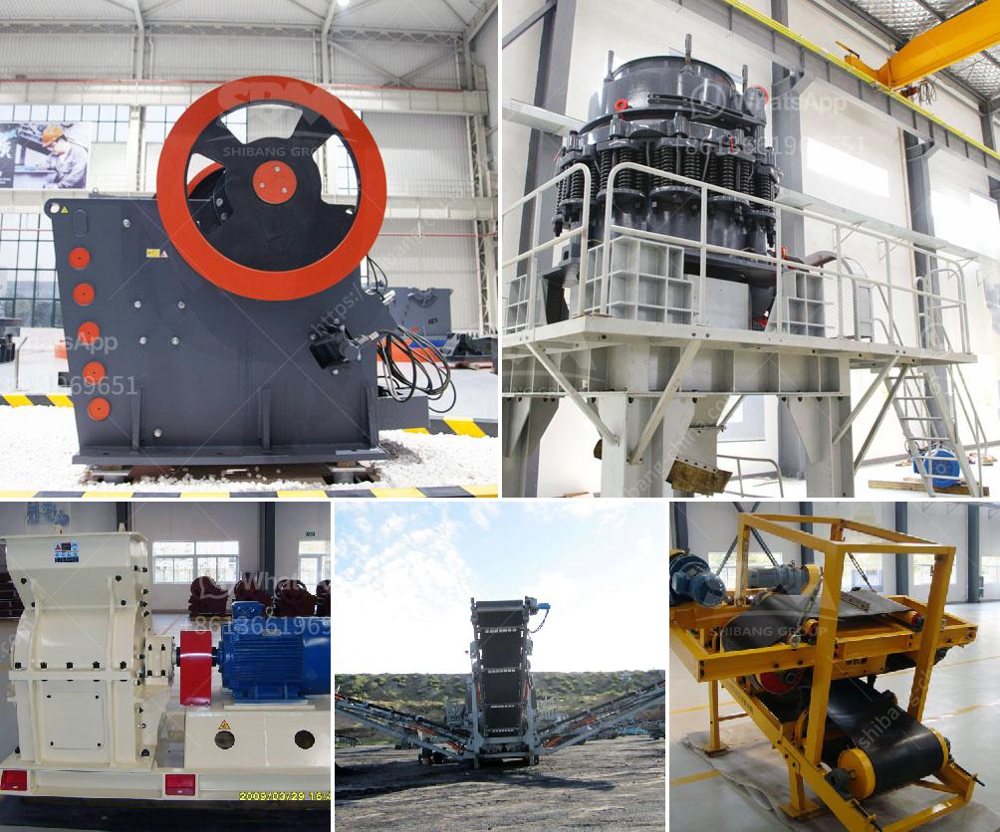

<h3>singapore mining conveyor belt supplier</h3>
Singapore is a bustling cosmopolitan city-state known for its impressive skyline, booming economy, and efficient infrastructure. Behind the scenes, the mining industry plays a crucial role in sustaining Singapore's rapid development. Mining operations require the constant transportation of raw materials, rocks, and debris, making conveyor belts indispensable in this sector.

Conveyor belts are mechanical systems designed to move materials efficiently from one location to another within a mining facility. They are crucial in optimizing the flow of materials and promoting productivity, contributing significantly to the overall success of mining operations. Singapore mining conveyor belt suppliers have emerged as key players in assisting mining companies to achieve their goals with top-notch conveyor belt solutions.

One reputable Singapore mining conveyor belt supplier is XYZ Mining Solutions. With years of experience and expertise in the field, they offer a wide range of conveyor belts specifically tailored to meet the unique demands of the mining industry. Their conveyor belts are known for their durability, reliability, and exceptional performance, making them a preferred choice among mining companies in Singapore and beyond.

When it comes to selecting conveyor belts, various factors need to be considered, such as the type of material being transported, the distance to be covered, the speed of operations, and environmental factors. Singapore mining conveyor belt suppliers understand these requirements and offer a variety of options to cater to diverse mining needs.

One popular choice for mining operations is the heavyweight conveyor belt. These belts are designed to carry massive loads over long distances without compromising efficiency or safety. XYZ Mining Solutions' heavyweight conveyor belts are made from premium materials, ensuring resistance against wear, tear, and impact, delivering optimal performance in rugged mining environments.

Another important consideration in the mining industry is the handling of materials with the potential for spillage and contamination. Singapore mining conveyor belt suppliers address this concern by offering spillage control solutions. These include belt scrapers, skirting systems, and dust control systems, preventing material loss, and maintaining cleanliness throughout the mining process.

Furthermore, safety is of paramount importance in mining operations. Conveyor belts equipped with sensor technology, such as belt rip detection systems and speed control sensors, are critical in preventing accidents and injuries. Singapore mining conveyor belt suppliers provide comprehensive safety solutions to enhance operational safety and protect workers on-site.

In addition to providing high-quality conveyor belts, Singapore mining conveyor belt suppliers also offer maintenance and repair services to ensure optimum performance and prolong the lifespan of conveyor systems. Regular maintenance, including belt tracking and cleaning, is crucial in preventing breakdowns and minimizing downtime, ultimately maximizing productivity.

In conclusion, Singapore mining conveyor belt suppliers play a vital role in the mining industry by providing reliable, durable, and efficient solutions to optimize material transportation. The expertise and innovative offerings of these suppliers contribute to enhancing productivity, safety, and overall operational efficiency for mining companies. With the right conveyor belt supplier, mining operations in Singapore can achieve sustainable growth and maintain their position as a pillar of Singapore's booming economy.
<h3>Contact us</h3><ul><li><strong>Whatsapp:&nbsp;<a href="https://wa.me/8613661969651">+8613661969651</a></strong></li><li><a href="https://swt.shibang-china.com/?git&amp;zhl&amp;singapore mining conveyor belt supplier"><strong>Online Service(chat now)</strong></a></li></ul><h3>Related</h3><ul><li><a href='second hand german jaw crusher for sale.md'>second hand german jaw crusher for sale</a></li><li><a href='china coal washing plant.md'>china coal washing plant</a></li><li><a href='limestone crusher kenya.md'>limestone crusher kenya</a></li><li><a href='rock crusher suppliers.md'>rock crusher suppliers</a></li><li><a href='sand and gravel crusher suppliers located in cebu.md'>sand and gravel crusher suppliers located in cebu</a></li></ul>