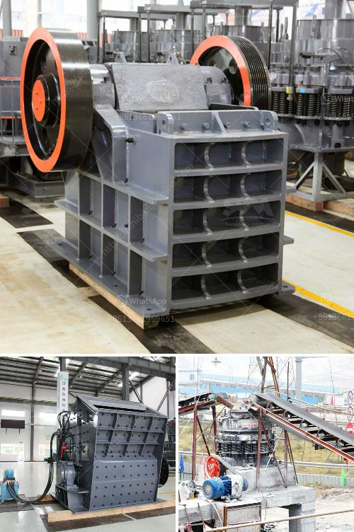

<h3>slag crusher machine project products</h3>
Slag is a by-product of metal smelting, and hundreds of tons of it are produced every year all over the world in the process of refining metals and making alloys. Like other industrial by-products, slag actually has many uses, and rarely goes to waste. It is often reused in construction or as a raw material for other industrial processes. However, one of the challenges in reusing slag is its size and consistency. And that's where the slag crusher machine comes in.

The slag crusher machine is a powerful crushing equipment that breaks and smashes slag by impact. It is designed to handle high-volume materials with sizes of up to 39 inches at a rate of 1,500 tons per hour. The newly installed crushers enable higher production and more efficient operations, helping to meet the increasing demand for slag.

One of the main components of slag is iron, which is recovered through crushing and separation processes. The slag crusher machine utilizes the crushing and recycling of materials to reduce waste. With its functioning, the slag crusher machine significantly reduces downtime and cuts down on production costs. These savings can then be passed on to customers during the manufacture of their desired products.

The slag crusher machines are also able to remove impurities, moisture, and other unwanted materials from the slag. It can be used in various applications, such as for crushing large rocks, recycling materials from construction and demolition sites, and breaking down slag into usable aggregate for farming or industrial practices. The versatility of the slag crusher machines allows them to feed materials of up to 30 inches in diameter into a high-volume crusher, ensuring efficient processing and minimizing downtime.

Furthermore, the slag crusher machine also removes foreign materials such as metal pieces or any other materials that may interfere with the quality of the final product. This ensures that the slag crusher machine is able to produce a high-quality product that is suitable for various applications. By eliminating impurities and unwanted materials, the slag crusher machine allows for the production of high-quality products with consistent performance.

The development of the slag crusher machine for sale has a long history, providing a broad range of choices for various industrial applications. And with years of experience in slag crushing, the equipment is completely reliable and highly efficient. The slag crusher machine for sale in India's market has been well received, as it can help contractors significantly reduce the production cost and achieve high profits in a short period.

Slag crusher machine is developed on the basis of traditional roller crusher, which integrates the crushing theory and advanced technique. Good performance and low cost make it a popular series in Indian industry. Slag crusher machine for sale in India also provides a competitive advantage over other existing crusher machines due to its versatility and efficiency. It can process many types of materials such as iron slag, coal, calcium carbide, quartz, dolomite, sulfide ore, gypsum, and various chemically and physically abrasive materials.

In summary, slag crusher machine project products are large-sized solid metal plates or bedplates attached to crusher/drive motors crushing equipment, which is a specialized crusher machine for slag recycling. With its functioning, the slag crusher machine significantly reduces downtime, cuts down on production costs, and provides high-quality products.
<h3>Contact us</h3><ul><li><strong>Whatsapp:&nbsp;<a href="https://wa.me/8613661969651">+8613661969651</a></strong></li><li><a href="https://swt.shibang-china.com/?git&amp;zhl&amp;slag crusher machine project products"><strong>Online Service(chat now)</strong></a></li></ul><h3>Related</h3><ul><li><a href='iron crushing equipment price.md'>iron crushing equipment price</a></li><li><a href='price 100 tph crusher plant.md'>price 100 tph crusher plant</a></li><li><a href='ore beneficiation equipment suppliers china.md'>ore beneficiation equipment suppliers china</a></li><li><a href='renting of screens and crushers.md'>renting of screens and crushers</a></li><li><a href='gold sand separation equipment philippines.md'>gold sand separation equipment philippines</a></li></ul>