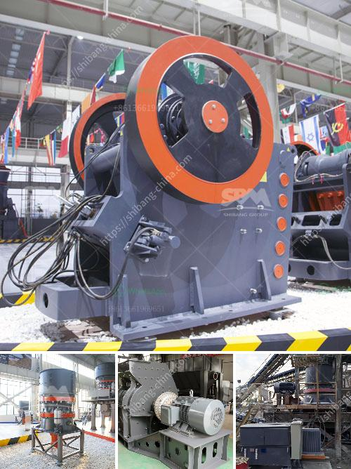

<h3>slag crusher plant supplier india</h3>
Slag, also known as blast furnace slag, is a byproduct generated during the manufacturing of pig iron. It is a non-metallic material consisting of the iron oxides and silicon oxides that result from removing impurities from iron ore in a blast furnace. Slag is widely used in construction, cement production, and other industries due to its high strength and durability.

To process and utilize slag effectively, several industries have focused on developing slag crushers. These crushers are designed to reduce the size and shape of the slag, making it easier to handle and recycle.

In India, where the iron and steel industry is highly prevalent, slag crushers are widely used to process steel slag, contributing to the recycling and reuse of waste in the country. In addition to consulting the specifications and functions of the machine, customers should purchase the slag crushing machine from reliable suppliers to ensure the quality and durability of the equipment.

- Equipment efficiency: The supplier should offer high-quality equipment that helps improve the productivity and efficiency of the steelmaking process. This includes factors such as high crushing efficiency, easy operation, and low maintenance requirements.

- Reliability and durability: Slag crushers are subjected to significant wear and tear, so they should be robust and reliable. Buyers should choose suppliers that offer machines that are designed to withstand tough operating conditions and have a long service life.

- After-sales service: A reliable supplier should provide excellent after-sales service, including technical support, regular maintenance, and troubleshooting assistance. This ensures that the equipment continues to operate at its best performance and minimizes downtime.

- Cost-effectiveness: The supplier should offer competitive prices for their equipment without compromising on quality. Buyers should consider the overall cost-effectiveness, including the initial investment, maintenance costs, and energy consumption.

- Customization options: Different industries and applications may have specific requirements. Finding a supplier that offers customization options allows the buyer to tailor the slag crusher to their specific needs and maximize its performance.

In India, several reputable slag crusher plant suppliers have emerged. They have been serving the key market segments with a wide range of crushing and screening equipment. The crushers are made of high-grade steel and are robust, durable, and require minimal maintenance.

Steel slag is similar to the traditional iron ore slag produced in blast furnaces during the iron-making process. However, this slag has a chemistry that makes it suitable for mineral manufacturers. The slag has become an important constituent of the cement industry, replacing natural materials. Additionally, it is used in various construction applications as a substitute for natural aggregates in concrete.

Slag crusher plants are equipped with high-precision, advanced technology, ensuring reliable back-to-back operations. These machines are strictly compliant with international quality standards, and they are extensively used in market-leading recycling processes.

To conclude, the slag crusher plant supplier India offers a wide range of possibilities to effectively process and utilize the waste in an environmentally friendly manner. They offer the best crusher technologies available on the market in order to meet the expectations of their customers.
<h3>Contact us</h3><ul><li><strong>Whatsapp:&nbsp;<a href="https://wa.me/8613661969651">+8613661969651</a></strong></li><li><a href="https://swt.shibang-china.com/?git&amp;zhl&amp;slag crusher plant supplier india"><strong>Online Service(chat now)</strong></a></li></ul><h3>Related</h3><ul><li><a href='trackmounted equipment.md'>track-mounted equipment</a></li><li><a href='cement plant maintenance manual pdf.md'>cement plant maintenance manual pdf</a></li><li><a href='business proposal preparation for mobile crusher.md'>business proposal preparation for mobile crusher</a></li><li><a href='pulverizer raymond mill.md'>pulverizer raymond mill</a></li><li><a href='stone crusher plant layout.md'>stone crusher plant layout</a></li></ul>