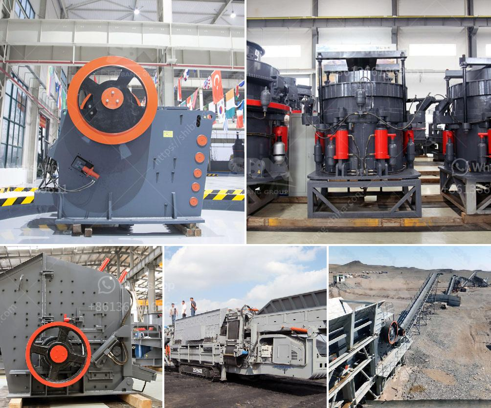

<h3>slag crushing machine hopper in india</h3>
Slag, a by-product of steel manufacturing, is often considered waste material. However, with the right technology, it can be recycled and utilized as valuable resources. Slag crushing machines with hoppers in India are designed to accomplish this task efficiently and economically.

Slag crushing machines are usually used in the initial stages of processing, where large pieces of slag are fed into the machine. The hoppers of these machines serve as a storage container, where the slag is temporarily stored before being fed into the crusher. This helps to ensure a continuous and smooth operation of the crushing process.

The hopper is an essential component of the slag crushing machine as it allows the slag to be fed into the machine at a controlled rate. This ensures that the machine does not become overloaded and can operate at its optimal capacity. Additionally, the hopper minimizes the risk of accidents and injuries by providing a safe and controlled feeding mechanism.

In India, there are several types of slag crushing machines available, each with different hopper capacities. The hopper size can range from a few hundred kilograms to several tons, depending on the size and capacity of the machine. It is crucial to select a machine with a hopper that matches the production requirements to achieve maximum efficiency.

Another important feature of the slag crushing machine hopper is its design. The hopper should be designed to prevent the slag from getting stuck or accumulating in the storage container. It should have smooth and sloping surfaces to facilitate the flow of slag into the crusher. Additionally, the hopper should be equipped with a reliable discharge mechanism, such as a conveyor belt, to ensure a consistent and controlled discharge of the crushed slag.

The design of the hopper should also take into consideration the environment in which the machine will operate. It should be made of durable and corrosion-resistant materials to withstand the harsh conditions often found in steel manufacturing facilities. The hopper should also be easy to clean and maintain, as regular maintenance is crucial for the efficient operation of the machine.

In conclusion, slag crushing machine hoppers in India play a critical role in the recycling and utilization of slag as valuable resources. These hoppers store and feed slag into the crushing machine, ensuring a continuous and controlled operation. The design, capacity, and material of the hopper are essential factors to consider when selecting a slag crushing machine. By investing in high-quality hoppers, steel manufacturers can maximize the efficiency and effectiveness of their slag recycling processes, contributing to a more sustainable and eco-friendly steel industry.
<h3>Contact us</h3><ul><li><strong>Whatsapp:&nbsp;<a href="https://wa.me/8613661969651">+8613661969651</a></strong></li><li><a href="https://swt.shibang-china.com/?git&amp;zhl&amp;slag crushing machine hopper in india"><strong>Online Service(chat now)</strong></a></li></ul><h3>Related</h3><ul><li><a href='ball mill in aluminum plant equipments.md'>ball mill in aluminum plant equipments</a></li><li><a href='stone crushing plant manufacturer.md'>stone crushing plant manufacturer</a></li><li><a href='jaw crusher for chrome ore for sale.md'>jaw crusher for chrome ore for sale</a></li><li><a href='250tph capacity of stone crusher.md'>250tph capacity of stone crusher</a></li><li><a href='tons a hour wash plant.md'>tons a hour wash plant</a></li></ul>