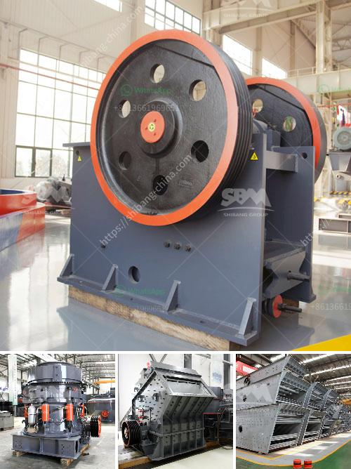

<h3>slag grinding ball mill</h3>
The slag grinding ball mill is an efficient grinding equipment, which grinds various slag into powder particles. The specifications of the equipment are: Φ4.2x13m for grinding slag in the workshop. This equipment adopts advanced grinding technology and has high production efficiency and low energy consumption. It can grind slag with different fineness to meet the needs of different industries.

Slag is a by-product of the metallurgical industry. After being processed, it can be used as cement additives or as raw materials for cement production, which plays a significant role in environmental protection and resource recycling. The slag grinding ball mill not only has good economic benefits, but also has a positive effect on reducing environmental pollution.

The slag grinding ball mill mainly consists of the feeding part, discharging part, rotating part, and transmission part (reducer, motor, and electric control). The hollow shaft is made of cast steel with a replaceable lining, which can withstand continuous wear and has a long service life.

The grinding body is generally made of steel balls, which are loaded into the cylinder according to different diameters and a certain proportion. The grinding body can also be made of ceramic balls and grinding stones for special applications. During the grinding process, the grinding body continuously impacts and grinds the slag, and the ground slag particles are gradually discharged from the discharge port.

The slag grinding ball mill has excellent characteristics such as large grinding capacity, low noise, stable operation, simple structure, convenient maintenance, low steel consumption, and improved production efficiency. It is widely used in cement, metallurgy, chemical industry, electric power, etc. It is the preferred equipment for grinding slag products.

In conclusion, the slag grinding ball mill is an efficient grinding equipment with high production efficiency and low energy consumption. It has good economic benefits and is conducive to environmental protection and resource recycling. The slag grinding ball mill is an ideal equipment for grinding slag.
<h3>Contact us</h3><ul><li><strong>Whatsapp:&nbsp;<a href="https://wa.me/8613661969651">+8613661969651</a></strong></li><li><a href="https://swt.shibang-china.com/?git&amp;zhl&amp;slag grinding ball mill"><strong>Online Service(chat now)</strong></a></li></ul><h3>Related</h3><ul><li><a href='machines used for cement manufacturing.md'>machines used for cement manufacturing</a></li><li><a href='chrome concentrate wash plant for sale.md'>chrome concentrate wash plant for sale</a></li><li><a href='method statement for a barite mill.md'>method statement for a barite mill</a></li><li><a href='mobile crusher datasheet.md'>mobile crusher datasheet</a></li><li><a href='mobile crushers philippines.md'>mobile crushers philippines</a></li></ul>