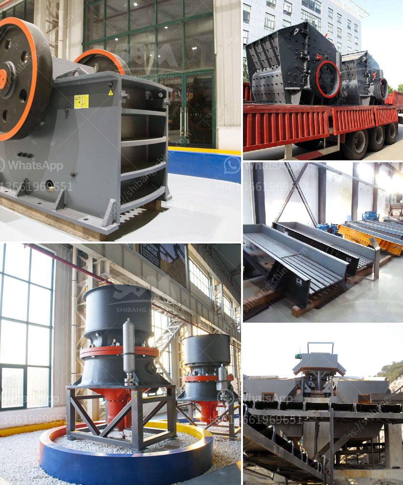

<h3>slag processing plant</h3>
A slag processing plant is a crucial facility for industrial businesses across various sectors. This plant performs several important tasks such as crushing, grinding, separating, and refining metals from their slag. Slag is a byproduct generated during the manufacturing of metals and comes primarily from the iron and steel industry.

The primary function of a slag processing plant is to process liquid and solid slag into usable materials. The liquid slag is transformed into granules or micronsized particles, while the solid slag is crushed into smaller particles for further processing. This plant utilizes various techniques such as crushing, magnetic separation, and grinding to extract valuable metals from the slag.

One of the major advantages of a slag processing plant is resource recovery. When metals are extracted from slag, they can be reused in various applications, eliminating the need for additional mining and reducing the environmental impact. This resource recovery process not only conserves energy but also promotes sustainability by reducing waste generation.

Apart from metal recovery, a slag processing plant also offers environmental benefits. Slag, if left untreated, can have harmful effects on the environment. It can contaminate soil and water bodies, posing a risk to both human health and ecosystems. By processing the slag and extracting metals, the plant ensures that these hazardous materials are properly managed and disposed of in an appropriate manner.

Additionally, a slag processing plant plays a crucial role in reducing landfill waste. By recycling slag, industrial businesses can significantly reduce the amount of waste sent to landfills, thereby minimizing the environmental impact. This not only conserves space but also reduces greenhouse gas emissions associated with waste decomposition.

The process of slag processing involves several steps. Initially, the slag is crushed into smaller particles using crushers. These crushers are designed to break down the slag into more manageable sizes. Once crushed, the slag is further processed through magnetic separation, where powerful magnets are used to separate the metallic and non-metallic components of the slag.

The metallic components are sent to smelting facilities or sold to other industries, while the non-metallic components are further processed through grinding mills. Grinding mills reduce the particles' size and make them suitable for specific applications, such as cement production or road construction.

In conclusion, a slag processing plant is an essential facility for industrial businesses that produce slag as a byproduct. This plant enables the extraction of valuable metals, conserves resources, reduces landfill waste, and mitigates environmental risks associated with untreated slag. The process involves various techniques such as crushing, magnetic separation, and grinding to transform slag into usable materials. By investing in a slag processing plant, industrial businesses can contribute to a more sustainable and eco-friendly future.
<h3>Contact us</h3><ul><li><strong>Whatsapp:&nbsp;<a href="https://wa.me/8613661969651">+8613661969651</a></strong></li><li><a href="https://swt.shibang-china.com/?git&amp;zhl&amp;slag processing plant"><strong>Online Service(chat now)</strong></a></li></ul><h3>Related</h3><ul><li><a href='control plan for ball mill manufacturing.md'>control plan for ball mill manufacturing</a></li><li><a href='belt conveyor design.md'>belt conveyor design</a></li><li><a href='double rotor impact hammer crusher.md'>double rotor impact hammer crusher</a></li><li><a href='small portable rock crushers for sale africa.md'>small portable rock crushers for sale africa</a></li><li><a href='granite crushing plants.md'>granite crushing plants</a></li></ul>